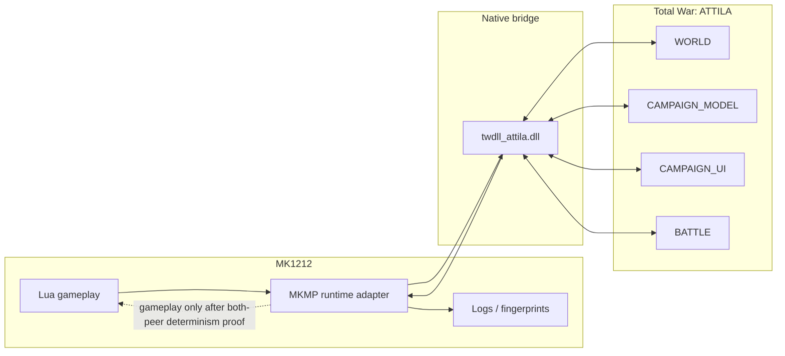
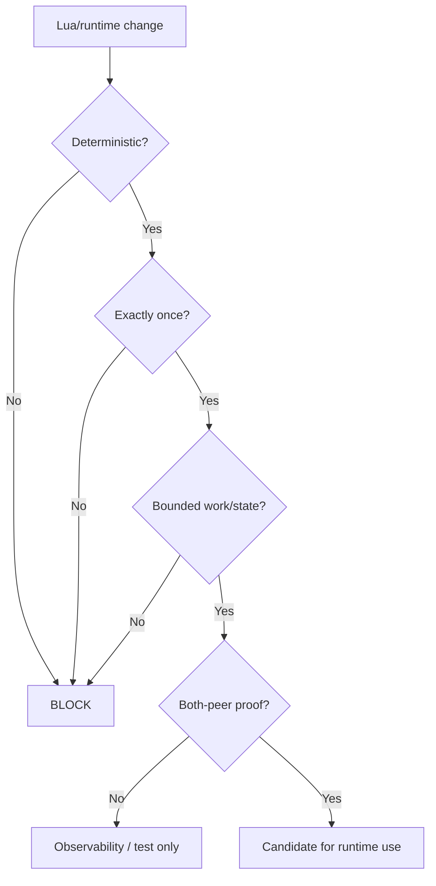

# MK1212Scripts

Scripts created for **Medieval Kingdoms 1212 AD** by DETrooper.

This fork preserves the original MK1212 script base and adds a Gumball-managed engineering/research layer focused on **multiplayer determinism, desync diagnosis, runtime observability and safe experimentation**.

Uses the Rome 2 Total Realism Scripting Toolkit courtesy of the R2TR development team.

## Project links

- MK1212Scripts fork: https://github.com/karnalooch/MK1212Scripts
- Our twdll fork: https://github.com/karnalooch/twdll
- Upstream twdll: https://github.com/bukowa/twdll
- twdll API docs: https://bukowa.github.io/twdll/
- ATTILA Assembly Kit: https://wiki.totalwar.com/w/Assembly_Kit_(TWA).html
- Research docs: [docs/research/README.md](docs/research/README.md)
- twdll observability architecture: [docs/research/TWDLL_OBSERVABILITY_BACKEND.md](docs/research/TWDLL_OBSERVABILITY_BACKEND.md)
- MP/OOS safety guardrails: [docs/research/SCRIPT_SAFETY_GUARDRAILS.md](docs/research/SCRIPT_SAFETY_GUARDRAILS.md)
- Upstream author handoff: [docs/research/MULTIPLAYER_HARDENING_AUTHOR_HANDOFF.md](docs/research/MULTIPLAYER_HARDENING_AUTHOR_HANDOFF.md)
- Full experimental MP profile: [docs/research/MP_FULL_EXPERIMENTAL_PROFILE.md](docs/research/MP_FULL_EXPERIMENTAL_PROFILE.md)

## Runtime observability architecture



The current design principle is simple:

> **Lua remains the brain of the mod; twdll is the eyes and stethoscope of the engine.**

Native/runtime data is initially for **read-only telemetry and diagnostics**. Raw pointers, timing, local UI state and other process-local values must never directly drive shared multiplayer gameplay.

## Why twdll matters

Upstream twdll already demonstrates that Attila Lua can load a custom native module:

```lua
local twdll = package.loadlib("twdll_attila.dll", "luaopen_twdll")()

twdll.core.Log("Hello from C++")
local faction_count = twdll.world.GetFactionCount()
```

That gives this project a practical path to:

- identify the **first** host/client state divergence before Attila reports OOS;
- capture campaign/battle runtime telemetry;
- build semantic world/faction/force fingerprints;
- observe risky boundaries such as battle -> campaign and end-turn;
- measure resource pressure without guessing;
- research future simultaneous-turn feasibility without making Lua scrape raw memory.

See the full design:  
**[twdll as the MK1212 runtime observability backend](docs/research/TWDLL_OBSERVABILITY_BACKEND.md)**

## Multiplayer safety model



The repository CI already rejects new obvious nondeterministic Lua sources such as:

- `math.random`;
- `math.randomseed`;
- `os.time`;
- `os.clock`.

See:

- [ATTILA MP stability failure catalogue](docs/research/ATTILA_MP_STABILITY_FAILURE_CATALOG.md)
- [Crash/OOM-like/resource-pressure hazards](docs/research/ATTILA_CRASH_OOM_RESOURCE_HAZARDS.md)
- [Multiplayer/runtime research playbook](docs/research/MP_RUNTIME_RESEARCH_PLAYBOOK.md)

## Documentation

Start at **[docs/README.md](docs/README.md)**.

The documentation deliberately separates:

1. official ATTILA tooling/scripting authority;
2. current MK1212 source behaviour;
3. exact-build runtime evidence;
4. modern Total War/WH3 references;
5. historical reverse-engineering evidence.

Compatibility is proven, not inferred.
