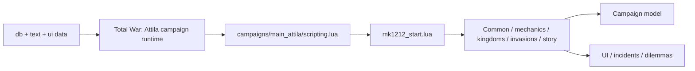
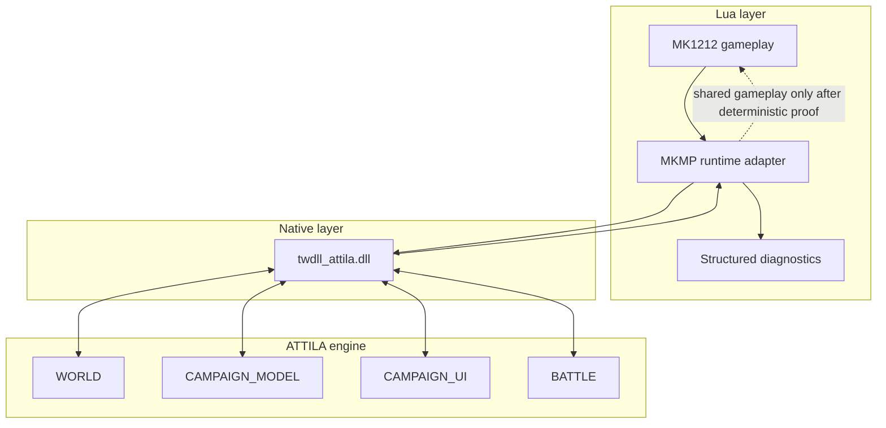

# Architecture

Status: **ACTIVE**

## Repository role

`MK1212Scripts` contains the scripting/data layer used by Medieval Kingdoms 1212 AD on Total War: Attila. This fork adds a repository-engineering layer around the existing upstream source without changing game behavior as part of the Gumball bootstrap.

## Runtime shape

The diagram describes ownership boundaries, not a network synchronization guarantee.

## Native observability extension

Issue #7 introduces a **read-only-first native observability lane** using twdll.

- canonical MK1212 native source: `native/twdll/`
- imported baseline: `karnalooch/twdll@85c4db9836e3150df8ec5b38315de9940f8d624c`
- historical fork/reference: https://github.com/karnalooch/twdll
- upstream: https://github.com/bukowa/twdll
- API docs: https://bukowa.github.io/twdll/
- canonical integration contract: [research/TWDLL_OBSERVABILITY_BACKEND.md](research/TWDLL_OBSERVABILITY_BACKEND.md)

The runtime adapter exists so ordinary Lua does not need raw memory/pointer knowledge.

Initial rule: **native data is diagnostic evidence, not automatic gameplay authority**.

## Source layout

- `campaigns/main_attila/` — campaign bootstrap and gameplay systems.
- `lua_scripts/` — frontend/global helper scripts.
- `script/_lib/` — R2TR scripting toolkit code.
- `db/` — database table fragments.
- `text/` — localization data.
- `ui/` — UI assets/content.
- `native/twdll/` — canonical MK1212 native observability/runtime-extension source, including vendored MinHook.

## Repository-engineering layer

- `gumball.yaml` — adopted Gumball profile and policy entry point.
- `.gumball/` — lifecycle, CI-cost and Proof Broker policy.
- `.github/workflows/` — trusted CI and repository automation.
- `scripts/gumball.py` and `scripts/ops/` — repository contract tooling.
- `scripts/ci/` — cheap project-local validation.
- `docs/` — documentation router and engineering contracts.

## Multiplayer boundary

Attila multiplayer executes campaign logic on multiple peers. A model-changing script is safe only when equivalent inputs produce equivalent model mutations on every peer.

For future multiplayer changes, separately classify:

1. deterministic campaign/model operations;
2. local UI-only behavior;
3. random-number sources;
4. listener/event ordering;
5. save/load state;
6. battle-to-campaign transitions.

Runtime multiplayer proof is intentionally not part of routine Gumball PR CI. When introduced, it must be exact-SHA and explicitly brokered/manual rather than silently becoming an expensive per-PR lane.
