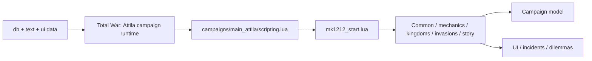
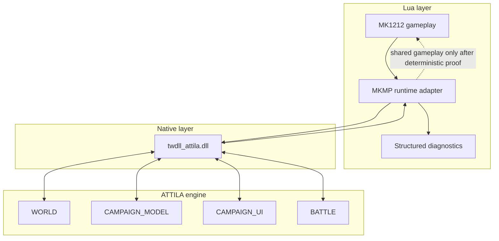

# Architecture

Status: **ACTIVE**

## Repository role

`MK1212Scripts` contains the scripting/data layer used by Medieval Kingdoms 1212 AD on Total War: Attila. This fork adds a repository-engineering layer around the existing upstream source without changing game behavior as part of the Gumball bootstrap.

## Runtime shape

The diagram describes ownership boundaries, not a network synchronization guarantee.

## Native observability extension

Issue #7 introduces a **read-only-first native observability lane** using twdll.

- canonical MK1212 native source: `native/twdll/`
- imported baseline: `karnalooch/twdll@85c4db9836e3150df8ec5b38315de9940f8d624c`
- historical fork/reference: https://github.com/karnalooch/twdll
- upstream: https://github.com/bukowa/twdll
- API docs: https://bukowa.github.io/twdll/
- canonical integration contract: [research/TWDLL_OBSERVABILITY_BACKEND.md](research/TWDLL_OBSERVABILITY_BACKEND.md)

The runtime adapter exists so ordinary Lua does not need raw memory/pointer knowledge.

Initial rule: **native data is diagnostic evidence, not automatic gameplay authority**.

## Source layout

- `campaigns/main_attila/` — campaign bootstrap and gameplay systems.
- `lua_scripts/` — frontend/global helper scripts.
- `script/_lib/` — R2TR scripting toolkit code.
- `db/` — database table fragments.
- `text/` — localization data.
- `ui/` — UI assets/content.
- `native/twdll/` — canonical MK1212 native observability/runtime-extension source, including vendored MinHook.

## Repository-engineering layer

- `gumball.yaml` — adopted Gumball profile and policy entry point.
- `.gumball/` — lifecycle, CI-cost and Proof Broker policy.
- `.github/workflows/` — trusted CI and repository automation.
- `scripts/gumball.py` and `scripts/ops/` — repository contract tooling.
- `scripts/ci/` — cheap project-local validation.
- `docs/` — documentation router and engineering contracts.

## Multiplayer boundary

Attila multiplayer executes campaign logic on multiple peers. A model-changing script is safe only when equivalent inputs produce equivalent model mutations on every peer.

For future multiplayer changes, separately classify:

1. deterministic campaign/model operations;
2. local UI-only behavior;
3. random-number sources;
4. listener/event ordering;
5. save/load state;
6. battle-to-campaign transitions.

Runtime multiplayer proof is intentionally not part of routine Gumball PR CI. When introduced, it must be exact-SHA and explicitly brokered/manual rather than silently becoming an expensive per-PR lane.

## AEEF product separation — Core / Tools / Native (decision 2026-10-08)

AEEF (Attila Engine Extension Framework) is a **free, open-source, community-driven fan project**. All functionality is free; no paywalls, exclusive paid features or commercial mod distribution are planned. Optional tips are **not enabled** without separately checking SEGA/Creative Assembly terms. No publisher endorsement is claimed.

**Architectural invariant:** AEEF Core must function without `twdll.dll`. Native is neither a dependency nor a fallback requirement for Core. Three separately reviewed lanes:

1. **AEEF Core:** independent, supported Lua/DB/Assembly Kit-based plugin SDK, capability negotiation, safe event subscriptions, fault isolation, deterministic replay, and mod-specific adapters. The MK1212 adapter must not contaminate the generic API with gameplay assumptions.
2. **AEEF Tools / Performance Lab:** external/offline benchmark harnesses, trace analyzers, graphics/CPU comparison, audit and build tools. Do not inject or modify Attila executable code just to collect baseline data.
3. **AEEF Native (optional):** `native/twdll/` GPL-3.0 component for experimental engine-state observation and separately reviewed native extensions. Availability and legal/publisher compliance are *independent checks*. Read-only semantic results may still require memory hooks and are not automatically approved for distribution.

A public Lua/DB-only baseline must have neither runtime nor distribution dependency on Native. GPL scope is not resolved by directory boundaries alone: dynamic linkage/integration requires specific legal review. Native executable memory modification, raw pointers and hook addresses must never become shared multiplayer gameplay authority. No DRM/CRC bypass, stealth or redistribution of proprietary SEGA code/assets.

### Issue ownership and boundaries

| Issues | Lane | Scope and limitation |
| --- | --- | --- |
| #47 | Research | TWASE/twdll license, ABI and hook conflict audit, not automatic adoption |
| #48 | Core | Versioned SDK, optional capability providers, MK1212 adapter |
| #49–#50 | Tools | Repeatable CPU, GPU, AA and battle-size benchmarks; no promises of FPS increases |
| #51 | Core + optional Native | Typed bounded snapshots; native batched reads only if proven and approved |
| #52–#53 | Core | Event-driven Lua sampling, listener ownership, plugin budgets and fail-soft behavior |
| #54 | Core research | Optional overlay logic LOD only when deterministic across peers |
| #55 | Tools + Core | Bounded profiler and evidence schema; optional native sensors |
| #56–#57 | Data/Core | Audited mount parameters and unit-level charge/fatigue; no assumption of independent horse physics |
| #58–#59 | Research | Battle AI/horse behavior feasibility; per-horse engine physics **unproven** |
| #60 | Compliance | Publisher terms, GPL, third-party assets and public release gates |
| #34–#35, #30 | Core simulation + separate engine feasibility | 4-peer protocol and simultaneous turns are not implied by a successful Lua simulator |
| #44, #46 | Optional Native diagnostics / Core fail-closed | Loader, WORLD capture, exact-SHA evidence and rollback |

**Evidence states:** DOCUMENTED / SOURCE-OBSERVED / CI-PROVEN / RUNTIME-PROVEN / HYPOTHESIS / BLOCKED. Green source CI proves builds and mocks, not true Attila runtime behavior. Maintain the user's **zero manual test** preference; unattainable unattended runtime checks are NOT RUN, not PASS.

### Capability boundary

`world.snapshot` is a read-only, versioned semantic capability, *not* permission to mutate a campaign. Plugins must check capability presence and return a defined unavailable result. Mutation capabilities require separate authorization, persistence/phase checks and HOST/CLIENT determinism proof. The Core must remain usable even if Native is rejected for distribution.
