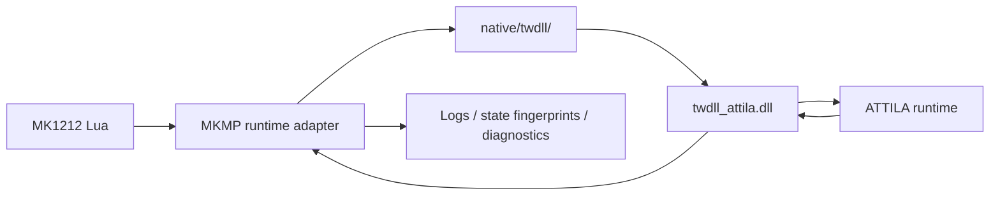

# MK1212Scripts documentation

This is the documentation router and authority map for this fork.

## Start here

- [Attila research authority](research/README.md) — source hierarchy for Assembly Kit, scripting, multiplayer, runtime instrumentation and cross-title research.
- [Upstream author handoff: multiplayer hardening](research/MULTIPLAYER_HARDENING_AUTHOR_HANDOFF.md) — detailed English report covering findings, merged fixes, remaining MP gates and final validation status.
- [twdll observability backend](research/TWDLL_OBSERVABILITY_BACKEND.md) — native Lua↔C++↔Attila architecture, safety boundaries, fallback contract and MP fingerprint plan.
- [twdll monorepo migration audit](research/TWDLL_MONOREPO_AUDIT.md) — post-merge import integrity, CI proof semantics, build identity and security-exception evidence.
- [`native/twdll/`](../native/twdll/) — canonical MK1212 native source; provenance is pinned in [`native/twdll/UPSTREAM.md`](../native/twdll/UPSTREAM.md).
- [Dual-peer MP simulation harness](research/MP_DUAL_PEER_SIMULATION.md) — CI-only fake HOST/CLIENT determinism, persistence fuzzing, source contracts and fault injection.
- [MP file debug logging](research/MP_DEBUG_LOGGING.md) — bounded `MK1212_mp_debug.log`, structured event schema and HOST/CLIENT comparator.
- [Architecture](ARCHITECTURE.md) — repository layout, runtime boundaries and authoritative surfaces.
- [Gumball adoption](GUMBALL_ADOPTION.md) — repository-platform baseline, current immutable platform pin and deferred items.
- [Diagram style](DIAGRAM_STYLE.md) — required Blueprint-style diagram conventions.
- [Tooling authority](TOOLING_AUTHORITY.md) — rules for selecting and admitting engineering tools.
- [Proof Broker](PROOF_BROKER.md) — exact-SHA heavyweight proof contract. No MK1212 heavyweight proof is enabled yet.
- [Security policy](../SECURITY.md) — reporting and repository security boundaries.

## Authority map

| Subject | Authority |
| --- | --- |
| Game/mod behavior | Lua/TSV/content under `campaigns/`, `lua_scripts/`, `script/`, `db/`, `text/`, `ui/` |
| Attila scripting/debug/runtime research | `docs/research/README.md` and its linked research documents |
| Native runtime observability / twdll | `native/twdll/` + `docs/research/TWDLL_OBSERVABILITY_BACKEND.md` |
| Agent workflow | `AGENTS.md` |
| Gumball adoption | `gumball.yaml` + `docs/GUMBALL_ADOPTION.md` |
| Repository lifecycle / labels / CI cost | `.gumball/repository-os.json` |
| Heavy proof routing | `.gumball/proof-broker.json` |
| Tool admission | `tools/capabilities.yaml` + `tools/authority-policy.json` |
| Security reporting | `SECURITY.md` |
| CI truth | `.github/workflows/ci.yml` and its caller-local `Aggregate CI gate` |

Do not create a second document for a subject already owned by one of these surfaces.

## Attila research set

- [Assembly Kit and scripting authority](research/ATTILA_ASSEMBLY_KIT.md)
- [WH3 debug drawing reference boundary](research/WH3_DEBUG_DRAWING_REFERENCE.md)
- [Historical Attila 1.6.0-9824 CE-table notes](research/ATTILA_CE_TABLE_1_6_0_9824.md)
- [MP/OOS/runtime research playbook](research/MP_RUNTIME_RESEARCH_PLAYBOOK.md)
- [ATTILA MP stability failure catalogue](research/ATTILA_MP_STABILITY_FAILURE_CATALOG.md)
- [Crash/OOM-like/resource-pressure hazards](research/ATTILA_CRASH_OOM_RESOURCE_HAZARDS.md)
- [Multiplayer scripting safety guardrails](research/SCRIPT_SAFETY_GUARDRAILS.md)
- [twdll runtime observability backend](research/TWDLL_OBSERVABILITY_BACKEND.md)
- [Dual-peer MP simulation harness](research/MP_DUAL_PEER_SIMULATION.md)

## Native observability map

Use the linked twdll document before proposing any Lua↔DLL integration or runtime-derived gameplay behaviour.
