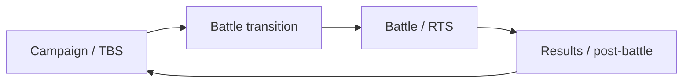

# Historical Attila 1.6.0-9824 Cheat Engine table — research notes

Authority class: **HISTORICAL-RE / Tier E**  
Primary source: https://github.com/Hexorg/CheatEngineTables/blob/master/tables/attila_total_war_v1-6-0-9824_steam_fennix102_ce65_s32_t31_160.ct  
Table target: Total War: ATTILA 1.6.0-9824  
Table date: 2016-06-15  
Last reviewed: 2026-10-06

## Purpose of this document

This file records what the table can teach us about **historical Attila runtime structure and reverse-engineering methodology**.

It does not import the cheat functionality into MK1212 and does not authorize binary patching.

## What the table establishes historically

The table targets `Attila.exe` / `Attila.dll` and contains:

- module-relative code locations;
- byte-pattern `assert` guards;
- allocated helper memory;
- jump hooks and return points;
- pointer/state captures;
- separate campaign/TBS and battle/RTS hook groups;
- explicit version history across several Attila builds;
- CRC-related hook labels and a "bypassing CRC-Check" feature.

These patterns prove only that the author identified those structures on the stated historical builds.

## Useful research patterns

### 1. Build-specific signatures

The table does not blindly write every location. It uses byte assertions around target sites.

Research lesson:

> Prefer signatures and structural validation over naked offsets.

For any modern runtime investigation, evidence should include:

- exact executable/module version;
- module hash where practical;
- signature bytes or symbolic evidence;
- expected control-flow context;
- proof that the target structure has the intended semantics.

A historical `Attila.dll+0x...` value alone is insufficient.

### 2. Campaign vs battle separation

The table explicitly groups targets into TBS (campaign/turn-based layer) and RTS (battle layer).

That reinforces an important architecture model for our research:



For desync work, record which layer first diverges.

Do not assume a post-battle campaign OOS originated in the battle layer; the engine may only detect an earlier divergence after returning to campaign.

### 3. Captured runtime pointers/state

The table stores observed pointers/state such as player, commander, province, troop and campaign-related structures.

Research lesson:

- observation points can be more valuable than mutation points;
- a first instrumentation prototype should prefer **read-only telemetry**;
- label observed values with build, thread/context, and trigger;
- avoid assuming structure offsets remain stable.

### 4. Turn-change and action-point hooks

Several historical hooks are labelled around:

- turn changing;
- construction/research progress;
- public order/growth;
- army/agent action points;
- post-battle action state.

This suggests useful places to investigate **conceptually** when studying simultaneous-turn feasibility:

- active/local player ownership;
- current turn owner;
- command acceptance;
- action-point consumption;
- turn barrier/round advancement;
- battle-to-campaign restoration.

These are hypothesis categories, not current addresses.

### 5. Battle-state hooks

The RTS group includes historical instrumentation/mutation around:

- selected troop;
- ammunition;
- battle units;
- damage/god-mode style hooks;
- unit stress.

For us, this is evidence that battle-state observation was feasible on the old build, not a reason to reuse those hooks.

## CRC entries: explicit boundary

The table contains:

- CRC-labelled targets;
- an environment-preparation script describing CRC-check bypass.

For this repository:

- CRC/DRM bypass implementation is **out of scope**;
- do not port, document operational bypass steps, or distribute a bypass;
- do not use bypass functionality as a prerequisite for supported MK1212 fixes;
- historical CRC labels may be mentioned only to understand why the old table was structured as it was.

## What must never be assumed

Never assume:

- the 1.6.0-9824 module offsets match a current Attila build;
- the same machine-code bytes still identify the same semantics;
- pointer layouts are unchanged;
- the same calling conventions/context are safe;
- Cheat Engine patchability implies mod/API support;
- a single-player memory mutation is multiplayer-safe;
- bypassing integrity checks is required for our objectives.

## Safe research use

Allowed use in this project:

1. derive names for conceptual subsystems to investigate;
2. learn historical signature/assert methodology;
3. learn to separate campaign and battle instrumentation;
4. identify useful read-only state categories;
5. compare old structure hypotheses against current official APIs and runtime evidence.

Not part of normal work:

- shipping memory cheats;
- shipping binary patches;
- disabling integrity/CRC mechanisms;
- distributing modified game binaries;
- assuming undocumented multiplayer replication.

## Future exact-build runtime note template

When a runtime experiment is eventually approved, record:

```text
Game build:
Executable/module hash:
Repository SHA:
Mod list/load order:
Host faction:
Peer faction:
Turn/round:
Trigger/event:
Observed subsystem:
Read-only or mutating:
Signature / symbol evidence:
Peer A result:
Peer B result:
State/hash comparison:
Conclusion:
Evidence state:
```

This table is valuable because it gives us historical hypotheses. It is not a present-day ABI.
