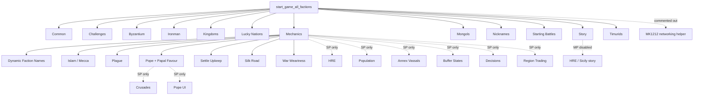
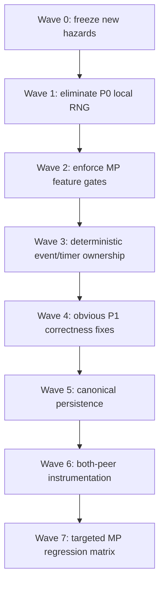

# MK1212 multiplayer runtime hazard audit

Status: **AUDIT SNAPSHOT / NO RUNTIME FIXES**  
Issue: #9  
Audited repository SHA: `ad3b3c3b1fb308c345d469bfc516a818bce68f17`  
Upstream gameplay baseline: `a55cd6fc66ff4b5d624bd3a80433987678b4adeb`  
Audit date: 2026-10-07

## Executive summary

The current MK1212 runtime contains a finite set of high-confidence multiplayer hazards that are sufficient to justify the long-standing community reports that "scripts" can be an OOS/desync source.

The strongest findings are not generic code-smell claims. They are concrete shared-model paths:

1. **Mongol invasion** uses Lua `math.random()` to choose force spawn coordinates and embeds those coordinates in the force ID.
2. **Timurid invasion** does the same.
3. **Greek Fire explosion** uses Lua `math.random()` to set building health.
4. **old-ruler heir generation** uses Lua `math.random()` for a newly spawned family-tree character.
5. **Challenges**, **Ironman** and **Lucky Nations** can be enabled from local ScriptedValueRegistry state even though the MP disclaimer describes some of them as disabled; some of those features mutate shared campaign state.
6. **vassal tracking** combines transient global variables with delayed `TimeTrigger` callbacks before performing model-affecting work, creating an event-order/timing hazard.

These are P0 candidates: direct mechanisms by which peers can compute or execute different shared state.

The audit also found multiple P1 stability/persistence defects, including an undefined `RegionRebels_Global` callback, a Mecca raze path that passes an undefined `faction`, unordered/unbounded save serializers, a one-slot unsaved deferred region-transfer queue, and post-battle/Papal logic on a historically fragile engine boundary.

This audit does **not** claim every P0 candidate has been reproduced as an OOS on the current 2026 executable. P0 means the static path is capable of producing divergent shared state or peer-specific shared mutation and therefore must be remediated or proven safe.

## Severity model

| Priority | Meaning |
| --- | --- |
| **P0** | Synchronization-critical: direct candidate for peer divergence, peer-specific shared mutation, or duplicated model mutation |
| **P1** | High stability/persistence risk: crash, script error, save/load, lifecycle, invalid-state, or dangerous transition boundary |
| **P2** | Review-required: suspicious pattern whose actual impact depends on runtime/event semantics |
| **P3** | Low MP risk: UI-only, frontend-only, dead/inactive MP path, or currently informational |

## Current multiplayer initialization surface



### Important discrepancy

The multiplayer frontend disclaimer says:

- Challenges are disabled;
- Ironman/Achievements are disabled;
- Crusades/HRE/Population/etc. are disabled.

Crusades/HRE/Population are actually guarded in runtime initialization.

**Challenges and Ironman are not force-disabled by an MP runtime guard.** Their initializers are called unconditionally. Lucky Nations is also initialized unconditionally and is controlled by local state.

Frontend code usually resets some local flags when campaign menus are entered, which reduces default exposure, but local frontend/SVR state is not a valid multiplayer synchronization contract.

---

# P0 — synchronization-critical findings

## P0-01 — Mongol spawn coordinates and force IDs use Lua RNG

**File:** `campaigns/main_attila/mongols/mongol_invasion.lua`  
**Function:** `SpawnMongolArmyInZone`  
**MP reachable:** yes; `Mongol_Initializer()` is unconditional.

Current path:

```lua
local x = math.random(zone.x1, zone.x2)
local y = math.random(zone.y2, zone.y1)

cm:create_force(
    faction_name,
    unit_list,
    region,
    x,
    y,
    faction_name .. tostring(x) .. tostring(y) .. tostring(turn_number),
    true,
    ...
)
```

### Why P0

If Lua RNG differs between peers:

- x differs;
- y differs;
- the force string ID differs;
- the newly created model entity is placed differently.

That is direct shared-model divergence.

The function is used both by the initial invasion and replenishment/army checks.

### Fix direction

Replace local Lua RNG with a narrow deterministic campaign RNG wrapper only after exact-build two-peer proof. Log the draw index, bounds, result and spawn token.

---

## P0-02 — Timurid spawn has the same unsafe RNG pattern

**File:** `campaigns/main_attila/timurids/timurid_invasion.lua`  
**Function:** `SpawnTimuridArmyInZone`  
**MP reachable:** yes; `Timurid_Initializer()` is unconditional.

The implementation mirrors P0-01 and uses random x/y in both position and force ID.

### Fix direction

Fix together with Mongols through one reusable deterministic spawn helper. Do not patch the two systems independently with slightly different semantics.

---

## P0-03 — Greek Fire random building damage mutates campaign model

**File:** `campaigns/main_attila/byzantium/byzantium_greek_fire.lua`  
**Function:** `DillemaOrIncidentStarted_Byzantium_Greek_Fire`  
**MP reachable:** yes; `Byzantium_Initializer()` always registers Greek Fire listeners.

Current path:

```lua
local health = building:percent_health()
local damage_amount = math.random(10, 40)
damage_amount = health - damage_amount
cm:instant_set_building_health_percent(
    CONSTANTINOPLE_KEY,
    building:name(),
    damage_amount
)
```

This is an especially strong P0 because the nondeterministic value is written directly to persistent building state.

### Fix direction

One deterministic draw per damaged building in stable slot order. Log building key, old health, draw and new health.

---

## P0-04 — old ruler fallback heir uses Lua RNG

**File:** `campaigns/main_attila/common/mk1212_common.lua`  
**Function:** `Check_Character_Age`  
**MP reachable:** yes; Common listeners are active in MP.

When a faction leader is at least 60 and no suitable heir is found:

```lua
cm:spawn_character_into_family_tree(
    ...,
    math.random(16, 30), -- Age
    ...,
    true,                -- Make Heir?
    false
)
```

The function is called:

- across faction characters during new-game setup;
- across **all faction leaders** whenever a human faction turn starts.

### Why P0

The random age becomes persistent family-tree/model state. Even if both peers create the same heir, different ages are already divergent model state.

### Fix direction

Use deterministic RNG and an exactly-once token keyed by faction/leader/turn. Prove that the listener executes the same number of draws on both peers.

---

## P0-05 — Challenges can be selected by local SVR and mutate shared state

**Files:**

- `campaigns/main_attila/challenges/main.lua`
- `campaigns/main_attila/challenges/challenge_judgement_day.lua`
- `campaigns/main_attila/challenges/challenge_this_is_total_war.lua`
- frontend state under `lua_scripts/frontend_challenges.lua`

**MP reachable:** initializer is unconditional.

At new game:

```lua
CHALLENGES_ENABLED[k] = svr:LoadBool("SBOOL_challenge_" .. k)
```

There is no runtime `cm:is_multiplayer()` force-off.

Gameplay effects include:

- changing CAI faction personality;
- forced war declarations;
- diplomacy restrictions.

### Why P0

A local registry value can control whether shared-model-affecting listeners exist on a peer.

The MP disclaimer claims Challenges are disabled, but runtime does not enforce that invariant.

### Mitigating evidence

Frontend scripts normally manipulate/reset challenge settings. This reduces default exposure but does not make local SVR a synchronized authority.

### Fix direction

In MP, force Challenges off in campaign runtime before any listener registration. Do not rely on frontend cleanup.

---

## P0-06 — Lucky Nations local SVR controls treasury/bundles/autoresolve

**File:** `campaigns/main_attila/luckynations/lucky_nations.lua`  
**MP reachable:** initializer is unconditional.

New-game state:

```lua
LUCKY_NATIONS_ENABLED = svr:LoadBool("SBOOL_LUCKY_NATIONS_ENABLED")
```

If enabled, the system can:

- apply `mk_bundle_lucky_nation`;
- add 2500 treasury to selected AI factions each turn;
- modify AI-vs-AI autoresolve.

### Why P0

This is local external state controlling shared campaign model.

Frontend code normally resets Lucky Nations false on menu transitions, but runtime must not depend on that side effect for MP correctness.

### Fix direction

Force false in MP and optionally fingerprint the local frontend/SVR settings for diagnostics.

---

## P0-07 — Ironman local state can register turn/save/runtime control

**File:** `campaigns/main_attila/ironman/ironman.lua`  
**MP reachable:** `Ironman_Initializer()` is unconditional.

On new game:

```lua
IRONMAN_ENABLED = svr:LoadBool("SBOOL_IRONMAN_ENABLED")
IRONMAN_SAVE_NAME =
    faction_localisation .. " Ironman " ..
    tostring(os.date("%Y%m%d%H%M%S"))
```

If enabled, Ironman registers listeners around:

- faction turn start/end;
- war/peace;
- pending battle;
- battle complete;
- UI;
- time triggers;

and can issue:

```lua
cm:end_turn(true)
```

based on local state after load.

### Why P0

The MP disclaimer says Ironman/Achievements are disabled, but runtime does not enforce that.

The wall-clock-derived save name is itself local-only. More importantly, the local enable flag controls runtime behavior at MP-sensitive boundaries.

### Fix direction

Force Ironman and its achievement listeners off in MP at runtime, regardless of SVR.

---

## P0-08 — vassal tracking uses delayed transient globals before model-affecting work

**File:** `campaigns/main_attila/common/mk1212_vassal_tracking.lua`  
**MP reachable:** yes; Common initializer always enables vassal tracking.

Transient module globals:

```lua
local liberator = nil
local proposer = nil
local recipient = nil
local vassal = nil
```

Events populate these values and then schedule:

```lua
cm:add_time_trigger("vassal_check", 0.1)
cm:add_time_trigger("diplo_vassal_check", 0.5)
```

The later callback can call `Faction_Vassalized`, transfer relationships and force peace.

### Why P0 candidate

The delayed callback is not tied to an immutable event payload. A second relevant event before the timer fires can overwrite the globals.

If callback timing/order differs between peers, different diplomatic relationships can be inferred and then converted into model-affecting operations.

### Fix direction

Replace shared transient globals with immutable, keyed event records and deterministic ownership. Prefer a campaign event/barrier over real-time delay for model mutation. Each pending operation needs a unique token and bounded queue.

---

# P1 — high stability / persistence findings

## P1-01 — undefined `RegionRebels_Global` callback

**File:** `campaigns/main_attila/common/mk1212_common.lua`

The Common initializer registers:

```lua
function(context) RegionRebels_Global(context) end
```

A repository-wide search at the audited baseline finds no definition for `RegionRebels_Global`.

### Risk

If the event fires, the callback can raise a Lua error.

This appears related to incomplete/removed separatist rebellion code; `Generate_Unit_List` also exists without an observed caller.

### Fix direction

Either restore a fully specified deterministic handler or remove the dead listener. Do not invent behavior during cleanup.

---

## P1-02 — Mecca raze path passes an undefined `faction`

**File:** `campaigns/main_attila/mechanics/islam/mechanics_islam_mecca.lua`  
**Function:** `CharacterPerformsOccupationDecision_Islam_Mecca`  
**MP reachable:** yes.

Current ordering:

```lua
if type == "RAZE" then
    Mecca_Destroyed(faction)
elseif ... then
    local faction = context:character():faction()
```

The local `faction` is declared only in the later branch.

### Risk

The RAZE path therefore resolves a global `faction` or nil. `Mecca_Destroyed` calls `faction:name()`.

This is a direct script-error/hidden-global dependency at an occupation transition.

### Fix direction

Bind the faction from context before the branch and validate it.

---

## P1-03 — save helpers serialize maps with unordered `pairs()`

**File:** `campaigns/main_attila/common/mk1212_common.lua`

Affected helpers:

- `SaveKeyPairTable`
- `SaveBooleanPairTable`
- `SaveKeyPairTables`

They concatenate save strings in `pairs()` order.

Also:

- `nicknames/nicknames_tracking.lua::SaveNicknamesStatsTable`

uses `pairs()`.

### Risk

Equivalent logical maps can produce different serialized byte/string order across Lua VMs.

For most current load helpers this reconstructs equivalent map semantics, so this is not automatically model divergence. But it creates:

- nondeterministic persistence bytes;
- poor basis for hashing/fingerprints;
- harder save comparison;
- hidden order dependency if future loaders or consumers become order-sensitive.

### Fix direction

Sort keys before serialization and version formats.

---

## P1-04 — save serialization is unbounded and unversioned

The common helpers build one concatenated string without:

- schema version;
- entry count limit;
- byte budget;
- duplicate validation.

Long-lived systems such as nicknames, vassal maps and sack history can feed these helpers.

### Risk

Persistence corruption/resource pressure is easier to create and harder to diagnose.

No OOM claim is made here.

### Fix direction

Version serializers, enforce entry/byte budgets, sanitize on load, and log rejected state.

---

## P1-05 — deferred region transfer is a one-slot, unsaved queue

**File:** `campaigns/main_attila/common/mk1212_common.lua`  
**Function:** `Transfer_Region_To_Faction`

The code intentionally postpones transfers during an AI faction's own turn because direct transfer is documented in-code as crash-prone:

```lua
REGION_TO_TRANSFER = { faction_name, region_name }
```

Only one pending transfer can exist.

It is not included in the Common save callback.

### Risks

- a second deferred transfer can overwrite the first;
- saving/loading before execution loses the pending operation;
- correctness depends on future faction-turn ordering.

### Fix direction

Use a bounded persisted queue with unique operation IDs and explicit processing phase.

---

## P1-06 — Papal Favour operates on the post-battle/timer boundary

**File:** `campaigns/main_attila/mechanics/pope/mechanics_pope_favour.lua`  
**MP reachable:** yes.

The system derives global state from `CharacterCompletedBattle`, then later changes Papal favour from post-battle callbacks and uses:

```lua
POSTBATTLE_DECISION_MADE_RECENTLY = true
cm:add_time_trigger("Postbattle_Decision_Pope", 1)
```

This sits on a boundary for which official Attila patch history contains MP crash fixes involving post-battle UI/order.

### Risk

- event ordering;
- shared global flag lifecycle;
- timer timing;
- repeated secondary-general callbacks;
- battle->campaign restoration.

### Classification

P1 until both-peer instrumentation proves identical ordering. If the relevant post-battle event is local-only on any path, upgrade to P0.

---

## P1-07 — story dilemma callbacks can mutate campaign state in MP

Examples:

- `story/story_aragon.lua`: force war + `create_force`
- `story/story_england.lua`: force diplomacy/war
- `story/story_france.lua`: force war/peace
- `story/story_hungary.lua`: persistent effect bundles

HRE/Sicily story events are disabled in MP, but several other story modules remain active.

### Risk

The model-changing callback is often `DilemmaChoiceMadeEvent`.

The audit has not yet established whether Attila delivers every relevant choice event with identical semantics to both MP peers.

### Classification

P1 pending two-peer event proof. Upgrade to P0 if a choice callback is only delivered locally while it performs shared mutation.

---

## P1-08 — hardcoded slot modification is local external state in MP

**File:** `campaigns/main_attila/mk1212_slots.lua`  
**MP reachable:** yes; slots listeners are initialized unconditionally.

`ModifyHardcodedLimits()` can:

- write `MK1212_10slots.exe`;
- execute it with `os.execute`;
- persist local SVR flags.

### Risk

Two peers may run with different hardcoded executable/state modifications.

This may manifest as:

- different local engine limits;
- load/version mismatch;
- campaign behavior mismatch;
- crash rather than clean OOS.

### Fix direction

For MP, either require/fingerprint identical limit state before campaign or remove runtime mutation from the campaign path.

---

## P1-09 — vassal save/load drops explicit empty lists

**Files:** common save helpers + `mk1212_vassal_tracking.lua`.

`SaveKeyPairTables` writes keys even when their value list is empty, but `LoadKeyPairTables` only restores a key when the loaded child list has at least one entry.

The vassal tracker sometimes assumes:

```lua
#FACTIONS_TO_FACTIONS_VASSALIZED[faction_name]
```

is valid.

### Risk

After load, factions with previously empty lists may not have a table entry until another path recreates it.

This can produce nil-access errors depending on event order after load.

### Fix direction

Preserve empty entries or make every reader use a canonical `get_or_create_vassal_list`.

---

## P1-10 — nickname bootstrap uses an undefined `faction_name`

**File:** `campaigns/main_attila/nicknames/nicknames_tracking.lua`

Historical nickname table keys are faction names, but new-game code does:

```lua
for k, v in pairs(HISTORICAL_CHARACTERS_TO_NICKNAMES) do
    if string.find(k, "mk_fact_") then
        local faction = cm:model():world():faction_by_key(faction_name)
```

The intended value appears to be `k`, not `faction_name`.

### Risk

This is an accidental dependency on a global variable or nil.

Because all current historical keys are `mk_fact_...`, the path is reachable on new game.

### Fix direction

Use the key explicitly and add null-interface validation.

---

# P2 — review-required findings

## P2-01 — `Generate_Unit_List` contains unsafe Lua RNG but appears unreachable

**File:** `common/mk1212_common.lua`

```lua
available_units[math.random(#available_units)]
```

Repository search found the definition but no call site at the audited baseline.

### Rule

Treat it as latent P0 debt. It must not become reachable before the RNG is fixed.

---

## P2-02 — networking helper is disabled and internally stale

**File:** `common/mk1212_networking.lua`

Startup explicitly comments out:

```lua
--Add_MK1212_Networking_Listeners()
```

The helper:

- schedules a recurring 0.5s `tick`;
- registers callback `TimeTrigger_Networking`;
- but defines `TimeTrigger_Pope_UI` instead;
- simulates clicks/keypresses into the multiplayer chat UI.

### Classification

Not a current runtime MP threat because it is not enabled.

It must **not** be re-enabled as a "networking solution." Replace it with a new, explicit observability/coordination design.

---

## P2-03 — duplicate Pope listener identifier

Two modules register the same listener ID:

`CharacterBecomesFactionLeader_Pope`

- `mechanics_pope.lua`
- `mechanics_pope_favour.lua`

Papal deactivation later removes that same ID.

The core callback sets `POPE_DEAD`; the favour callback removes excommunication.

### Current impact

`POPE_DEAD` is primarily used by Pope College code, which is currently not enabled. Therefore this is not promoted to P1/P0 for the current MP path.

### Structural risk

The result depends on `cm:add_listener` duplicate-name semantics and becomes dangerous if Pope College is re-enabled.

### Fix direction

Unique listener IDs and explicit feature ownership.

---

## P2-04 — Nicknames combine unordered trait iteration with RNG

**File:** `nicknames/nicknames_tracking.lua`

`Check_Character_Nickname`:

- iterates `TRAITS_TO_NICKNAMES` using `pairs()`;
- conditionally calls `cm:random_number`.

If the same qualifying traits exist, the number of RNG calls should normally remain equal but individual random results can be assigned to different traits when iteration order differs.

### Current impact

Nicknames are primarily script/UI state, so this is not currently classified P0.

### Fix direction

Sort trait keys before any RNG sequence.

---

## P2-05 — `cm:random_number` / `random_percent` still needs Attila exact-build proof

The codebase uses engine/campaign RNG in:

- Pope changeover;
- Papal favour;
- nicknames;
- Greek Fire timers;
- other SP-only systems.

This is the likely correct synchronization mechanism, but this project should not mark it RUNTIME-PROVEN until both peers produce identical draw sequences on the current build.

---

## P2-06 — Plague performs broad world mutation from faction-turn phase

**File:** `mechanics/mechanics_plague.lua`  
**MP active:** yes.

The active code is largely deterministic and its random contraction logic is commented out.

At historical phase boundaries it scans factions/forces/regions and applies plague.

### Risk

Large global mutation at faction-turn boundary; needs state fingerprinting and save/load proof.

No direct unsafe RNG found in active plague paths.

---

## P2-07 — War Weariness is battle-boundary persistent state

**File:** `mechanics/mechanics_war_weariness.lua`  
**MP active:** yes.

It tracks persistent Lua maps, updates effect bundles after battle and on faction turns, and uses the unordered generic save serializer.

No direct Lua RNG was found.

### Risk

Battle->campaign boundary plus persistence; test rather than disable by assumption.

---

## P2-08 — Dynamic Faction Names auto-mutates names in MP

**File:** `mechanics/mechanics_dynamic_faction_names.lua`  
**MP active:** yes.

SP player decisions are gated, while MP uses automatic promotion based on deterministic region counts.

### Risk

Shared scripted state + rename operation. Needs two-peer state/fingerprint proof but no direct P0 source was found.

---

## P2-09 — Kingdom events are intentionally auto-mode in MP

Kingdom initializers run in MP. Individual modules commonly use:

```lua
if cm:is_multiplayer() == true or context:faction():is_human() == false then
    ...
```

to avoid player decision UI and use automatic behavior.

### Risk

Large surface area, but design appears to account for MP explicitly.

Audit exact mutation paths as each kingdom becomes part of a reproducer; no blanket P0 found in this pass.

---

## P2-10 — Starting Battle runs at an engine transition boundary

**File:** `startingbattles/startingbattle_lasnavas.lua`

The new-game setup can issue `cm:attack(...)`; `BattleCompleted` applies a victory effect and removes its listener.

The UI click callback only changes loading-screen text.

### Risk

Battle initiation/result boundary. Requires exact-save MP regression test.

---

## P2-11 — human-player ordering is an implicit assumption

`HUMAN_FACTIONS` is reconstructed by walking the engine faction list and is consumed through indices `[1]` and `[2]` in several systems.

Most observed uses are messages/Hajj/invasion notifications.

### Risk

The project assumes the engine faction-list iteration order is identical on peers.

Include ordered human faction keys in future environment/state fingerprints.

---

## P2-12 — common UI local state is mostly guarded, but remains a taint boundary

`common/ui/mk1212_global_ui.lua` runs in MP and tracks:

- selected diplomacy faction;
- panel state;
- local selection state.

The potentially model-relevant religion recheck is explicitly guarded:

```lua
if cm:is_multiplayer() == false then
    cm:add_time_trigger("religion_possibly_changed", 0.0)
end
```

Therefore no current P0 local-UI->model path was confirmed here.

Keep the module classified as a local-data taint boundary.

---

# P3 — currently low MP risk / inactive

## Frontend random faction selection

`lua_scripts/frontend_scripted.lua` uses `math.random` for random **frontend faction selection**.

No campaign model mutation is involved.

P3, provided it remains frontend-only.

## Pope UI `math.random(8)`

The random count is used to create decorative faction-logo UI children.

Pope UI listeners are only enabled in SP.

P3 for multiplayer.

## Crusades / HRE / Population / Annex / Buffer / Region Trading / Decisions

These modules contain many high-risk patterns — timers, `pairs()`, diplomacy, force spawning and UI-driven mutation — but their feature initializers are currently excluded from MP by `Mechanic_Initializer` or Pope MP gating.

They remain relevant technical debt if anyone proposes re-enabling them.

---

# Cross-cutting defects and invariants

## 1. Local configuration is not multiplayer authority

The largest architectural defect after Lua RNG is reliance on:

- ScriptedValueRegistry;
- local frontend state;
- local executable patch state;

to select campaign behavior.

The runtime must enforce MP-safe values independently of the frontend.

## 2. Real-time timers must not carry shared mutable intent

A safe delayed model operation needs:

- immutable payload;
- unique operation ID;
- owner;
- bounded queue;
- cancellation semantics;
- deterministic execution phase.

Transient module globals plus `add_time_trigger` do not satisfy this.

## 3. Save format needs deterministic canonicalization

All future fingerprints and migrations require:

- sorted keys;
- versioned schema;
- bounded size;
- explicit empty-value semantics.

## 4. Exactly-once semantics are mostly implicit

Many systems rely on booleans, current turn, or listener removal.

High-impact operations need explicit tokens:

```text
feature | turn | phase | faction | entity | operation
```

## 5. Detection point is not divergence point

An Attila OOS report at end turn cannot prove the first divergence occurred there.

Future instrumentation should fingerprint state around the P0 paths before and after mutation.

---

# Mandatory target coverage

| Target requested by issue #9 | Audit status | Priority |
| --- | --- | --- |
| Mongol invasion | direct unsafe RNG found | P0 |
| Timurid invasion | direct unsafe RNG found | P0 |
| Byzantium Greek Fire | direct unsafe RNG -> building health | P0 |
| common heir/family tree | direct unsafe RNG -> spawned heir | P0 |
| separatist unit generation | unsafe RNG found but no caller | P2 latent |
| Pope/Papal | active MP; postbattle/lifecycle risks | P1/P2 |
| War Weariness | active; battle/persistence boundary | P2 |
| Islamic mechanics / Mecca | active; undefined RAZE variable | P1 |
| Plague | active; broad deterministic world mutation | P2 |
| Silk Road | active; bounded deterministic bundle update | P3/P2 |
| Dynamic Faction Names | active automatic MP path | P2 |
| Starting Battles | active battle transition | P2 |
| Story Events | several MP-active dilemmas mutate model | P1 |
| Kingdom systems | automatic MP paths found | P2 |
| networking helper | disabled, stale/broken | P2 latent |
| save/load helpers | unordered/unbounded serializers | P1 |
| frontend randomness | UI-only random faction selection | P3 |
| Challenges | local SVR can enable model changes | P0 |
| Ironman | local SVR can enable MP-sensitive runtime behavior | P0 |
| Lucky Nations | local SVR can change economy/autoresolve | P0 |
| slots hardcoded limits | local external executable state | P1 |

---

# Recommended remediation order



## Wave 0 — already partly present

Current CI already blocks newly added:

- `math.random`;
- `math.randomseed`;
- `os.time`;
- `os.clock`;

in runtime diffs.

## Wave 1 — deterministic RNG foundation

Fix together:

- Mongol spawn;
- Timurid spawn;
- Greek Fire damage;
- heir age;
- latent `Generate_Unit_List`.

Create one deterministic RNG contract and verify it on two peers.

## Wave 2 — runtime-enforced MP feature gates

Force MP-safe state for:

- Challenges;
- Ironman/Achievements;
- Lucky Nations;

and decide/fingerprint slot-limit state.

Frontend state must be informational only.

## Wave 3 — delayed operation ownership

Redesign vassal tracking delayed state first.

Then audit all model-affecting `TimeTrigger` paths before allowing them in MP.

## Wave 4 — correctness/stability fixes

Small isolated fixes:

- Mecca RAZE undefined variable;
- undefined `RegionRebels_Global`;
- nickname historical-key bug;
- duplicate listener IDs;
- deferred transfer queue.

## Wave 5 — persistence foundation

Replace map save helpers with:

- sorted-key serialization;
- schema versions;
- explicit empty maps;
- bounds;
- migration/default rules.

## Wave 6 — observability

Issue #7 tracks twdll evaluation.

Once exact-build compatibility is proven, use read-only semantic fingerprints around:

- invasion spawns;
- Greek Fire;
- heir creation;
- Papal postbattle;
- story dilemmas;
- vassalization;
- end-turn.

## Wave 7 — regression matrix

Minimum scenarios:

- new MP campaign with every local feature flag intentionally mismatched;
- forced Mongol invasion early;
- forced Timurid invasion early;
- Greek Fire explosion;
- 60+ leader with no heir;
- vassalization/subjugation sequence;
- Mecca raze;
- Papal war/postbattle;
- story dilemma that creates force/war;
- manual battle -> campaign;
- river/bridge;
- coastal assault;
- full AI/end-turn cycle;
- save/reload immediately before a deferred operation.

---

# Static checks to add after the first fixes

Do not add checks that merely make legacy CI permanently red. Add them as each debt class is removed.

## Must become fail-closed

1. no runtime `math.random` / local entropy;
2. no new campaign-runtime `svr:Load*` that controls shared behavior;
3. unique `cm:add_listener` IDs;
4. no registered callback whose global function cannot be resolved statically where the callback is a simple named function;
5. deterministic save serializers for key/value maps;
6. no raw `os.execute` in MP-reachable campaign code without explicit policy exception.

## Advisory until migrated

1. model mutation from `TimeTrigger`;
2. model mutation from UI/click listeners;
3. `pairs()` near RNG/mutation/serialization;
4. `cm:get_local_faction()` flowing into shared mutation;
5. `create_force`, character spawn, diplomacy, region transfer and building health changes without guard helpers.

---

# What this audit does not prove

This is a static/code-path audit.

It does not prove:

- which P0 candidate is responsible for a specific historical user's OOS;
- that `cm:random_number` is synchronized on the current 2026 build;
- that every `DilemmaChoiceMadeEvent` is delivered identically on both peers;
- that every `TimeTrigger` callback timing differs;
- that vanilla Attila bridge/coastal/battle-transition desyncs can be fixed in Lua;
- that any crash is OOM.

Those claims require exact-build runtime evidence.

## Exit criterion

The audit can be considered complete when each P0/P1 finding has either:

- a dedicated remediation issue;
- an explicit accepted-risk decision; or
- runtime evidence downgrading/rejecting it.

No gameplay/runtime source is changed by this audit document.
