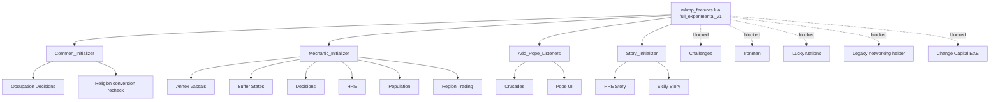

# MK1212 full experimental multiplayer script profile

Status: **EXPERIMENTAL / repository-tested / runtime two-peer proof pending**  
Issue: #30  
Profile ID: `full_experimental_v1`  
Last reviewed: 2026-10-07

## Purpose

MK1212 historically disables a substantial set of campaign scripts whenever `cm:is_multiplayer()` is true.

The hardened fork now has a central multiplayer feature registry and an explicit **full experimental profile** that re-enables those script-side mechanics for engineering validation.

This is not a claim that every feature is already proven safe on two real Attila peers.

The distinction is deliberate:

- **enabled in script** means the relevant listeners and systems are now initialized in multiplayer;
- **repository-tested** means the code is covered by static/source contracts, dual-peer simulation and the MP matriculation suite;
- **runtime-proven** still requires issue #15 with two real Attila peers.

## Canonical registry

The runtime authority is:

`campaigns/main_attila/common/mkmp_features.lua`

Profile:

```text
full_experimental_v1
```

Every feature has:

- `enabled`;
- `mode`.

Unknown features fail closed.

The profile identity and complete feature matrix are included in the multiplayer environment fingerprint.

## Feature modes

| Mode | Meaning |
| --- | --- |
| `shared_model` | Primarily driven by campaign/model events and shared state. Still requires real runtime proof for Attila event semantics. |
| `experimental_local_ui` | Enabled, but local UI can initiate gameplay mutation. Repository contracts can test the code, but real host/client replication is not yet proven. |
| `experimental_choice_event` | Enabled and dependent on dilemma/choice event propagation that remains to be proven on two real peers. |
| `observability_only` | May observe/log runtime state but may not drive shared gameplay. |
| `blocked_local_config` | Intentionally disabled because peer-local configuration could create different gameplay. |
| `blocked_stale` | Old experimental implementation intentionally left disabled. |

## Full feature matrix

### Existing multiplayer baseline

Enabled:

- Common campaign systems;
- Byzantium;
- Kingdoms;
- Mongol invasion;
- Timurid invasion;
- Nicknames;
- Starting Battles;
- core Story Events;
- Dynamic Faction Names;
- Islam/Mecca;
- Plague;
- Pope core/Papal Favour;
- Settle Upkeep;
- Silk Road;
- War Weariness;
- vassal tracking;
- twdll observability.

### Newly unlocked by the full experimental profile

| Feature | Mode | Script status |
| --- | --- | --- |
| Annex Vassals | `experimental_local_ui` | enabled |
| Buffer States | `experimental_local_ui` | enabled |
| Decisions | `experimental_local_ui` | enabled |
| Holy Roman Empire | `experimental_local_ui` | enabled |
| Population | `experimental_local_ui` | enabled |
| Region Trading | `experimental_local_ui` | enabled |
| Occupation Decisions / region gifting | `experimental_local_ui` | enabled |
| Religion conversion UI recheck | `experimental_local_ui` | enabled |
| Crusade event system | `experimental_local_ui` | enabled |
| Pope/Crusade UI | `experimental_local_ui` | enabled |
| HRE Story Events | `shared_model` | enabled |
| Sicily Story Events | `experimental_choice_event` | enabled |

### Intentionally blocked

| Feature | Reason |
| --- | --- |
| Challenges | local frontend/SVR modifier; can alter shared gameplay |
| Ironman/Achievements | local save/turn behavior; not a missing core campaign mechanic |
| Lucky Nations | local frontend/SVR modifier; affects treasury/effects/autoresolve |
| legacy MK1212 networking helper | stale UI/chat/timer experiment, not a synchronization backend |
| Change Capital helper | invokes a local external executable; blocked as an in-session external mutator |

## Initialization architecture



## Why local-UI features are marked experimental

Attila scripting does not provide this project with a currently proven generic mechanism that says:

> a click executed on one peer is guaranteed to execute the same Lua callback with the same model mutation on the other peer.

Several previously disabled systems contain local UI paths that directly or indirectly reach campaign-model operations.

Examples include:

- Region Trading;
- Buffer States;
- generic Decisions;
- region gifting after occupation;
- religion conversion UI recheck;
- HRE UI actions;
- Crusade/Pope UI.

They are now initialized so the complete script profile can be exercised, but their mode remains `experimental_local_ui`.

The profile does not hide this uncertainty.

## MP matriculation suite

The high-level integration test is:

`scripts/ci/test_mp_matura.py`

It runs as part of the normal:

```bash
python -m unittest discover -s scripts/ci -p "test_mp_*.py" -v
```

The matriculation test verifies the complete profile in one pass:

1. all expected unlock targets are enabled and classified;
2. blocked local modifiers remain blocked;
3. production Lua initializers actually use the feature registry;
4. frontend warning identifies the profile as experimental;
5. 200 randomized fake HOST/CLIENT pairs produce identical shared transcripts;
6. invalid RNG output fails before shared mutation;
7. 500 randomized save maps produce canonical output;
8. save/load/save preserves explicit empty nested state;
9. vassal event arrival order does not affect unambiguous results;
10. ambiguous vassal correlation produces no guessed mutation;
11. the 64-entry deferred transfer queue survives serialization and rejects overflow;
12. native-adapter failures do not become gameplay authority;
13. different process-local native addresses are filtered;
14. the first-divergence detector still reports a deliberately injected mismatch.

A successful run prints:

```text
MK1212 MP MATRICULATION: PASS
(profile=full_experimental_v1, randomized_peer_pairs=200, save_fuzz_cases=500)
```

## Evidence boundary

A green matriculation result means:

> The repository's explicit full experimental multiplayer contract is internally consistent under the modeled adversarial conditions.

It does **not** mean:

- local UI clicks are proven replicated by Attila;
- dilemma choice events are proven identical on both peers;
- `cm:random_number` has been proven lockstep on the current executable;
- battle->campaign transitions are proven;
- vanilla Attila OOS bugs are solved.

Those remain for issue #15.

## Runtime validation target

The eventual two-peer test should run this exact feature profile and compare the proof harness around:

- local UI initiated actions;
- dilemmas;
- Crusade joins/leaves;
- HRE votes/reforms/events;
- Region Trading;
- Buffer States;
- Occupation region gifting;
- Annex Vassals;
- Population recruitment/battle accounting;
- save/load with the full profile active.

Until that proof exists, the correct label is:

**EXPERIMENTAL FULL MP SCRIPT PROFILE**
