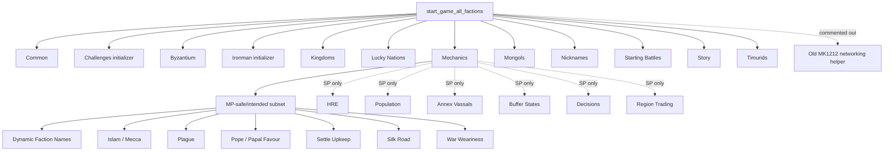
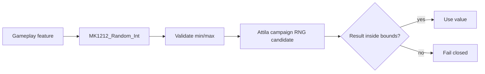
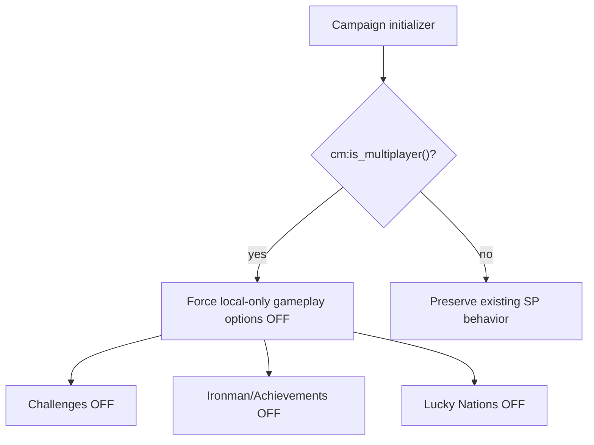
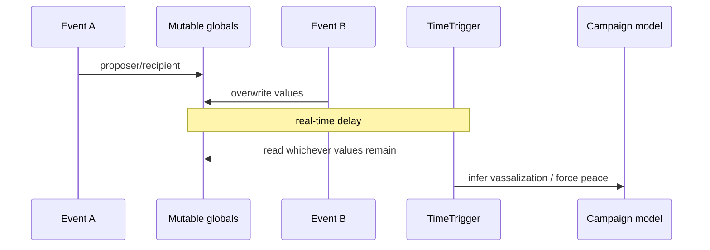
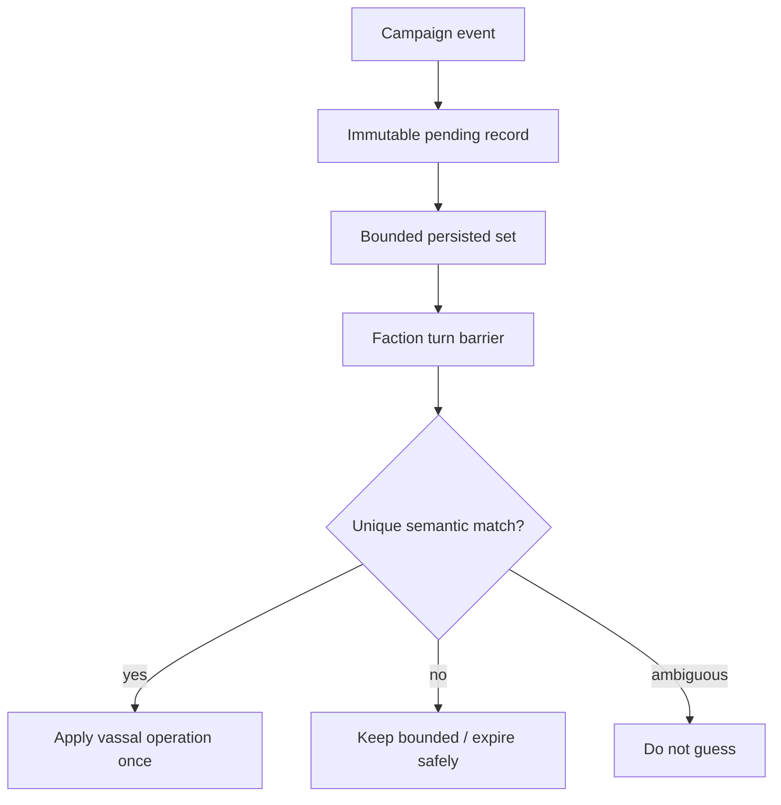
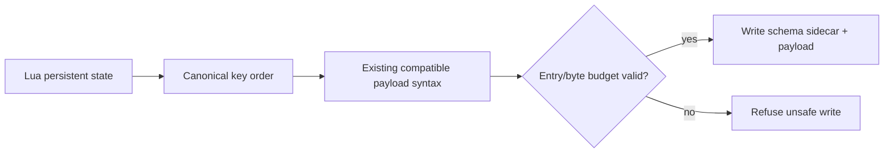
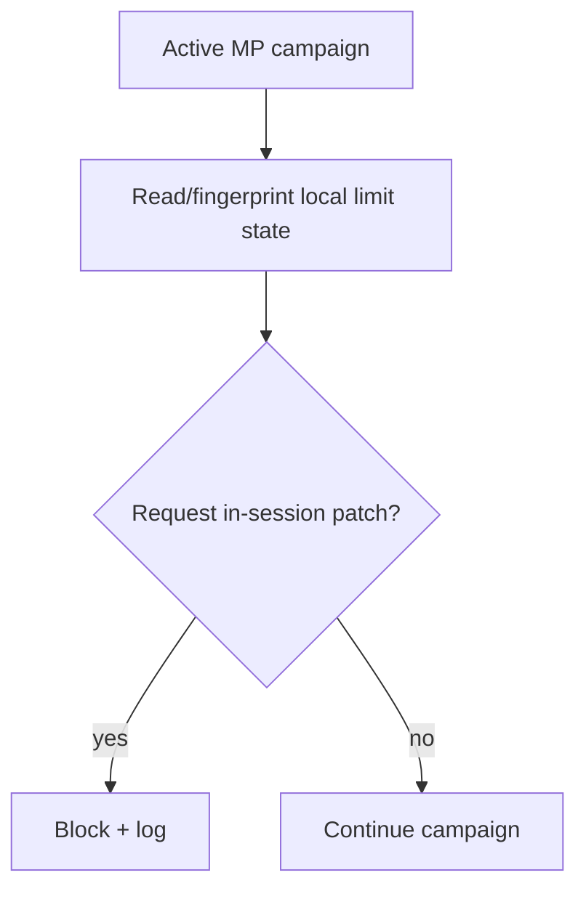
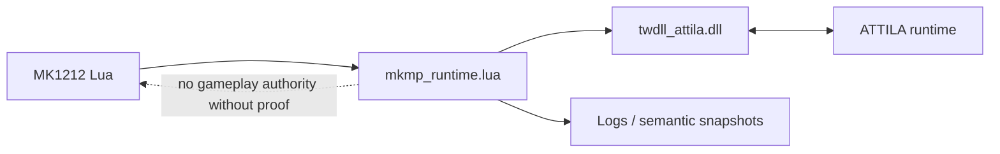
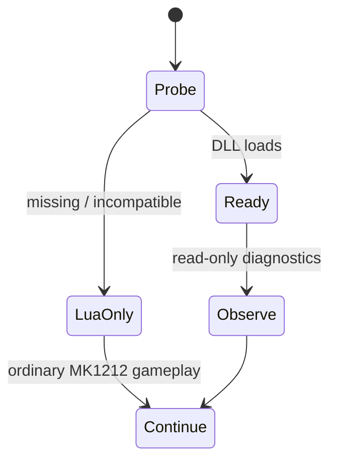
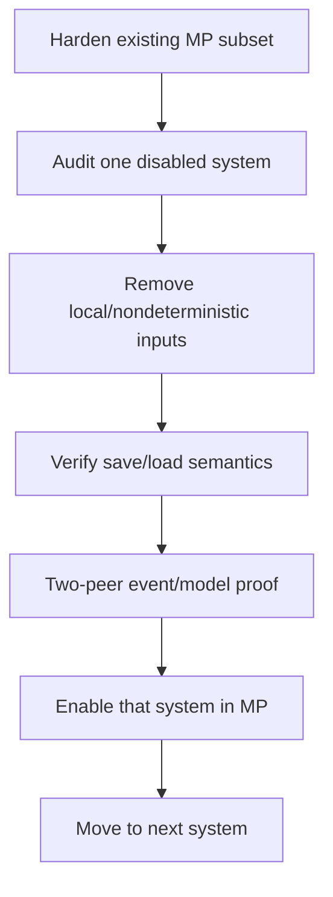

# MK1212 Multiplayer Hardening — Technical Handoff for the Upstream Author

Status: **implementation handoff; final runtime validation pending**  
Prepared from fork: https://github.com/karnalooch/MK1212Scripts  
Original upstream: https://github.com/DETrooper/MK1212Scripts  
Current hardened fork baseline described here: `6960e036829219691b36657920e083419899e9c4`  
Date: 2026-10-07

## Executive summary

This fork was created to investigate long-standing multiplayer campaign desynchronization and stability problems in MK1212 without rewriting the mod or changing its intended gameplay.

The main conclusion from the audit is that MK1212 contains several concrete script paths that can plausibly create different campaign state on two multiplayer peers. The most important examples were not theoretical engine issues; they were explicit Lua-side hazards such as:

- `math.random()` feeding values directly into persistent campaign mutations;
- local ScriptedValueRegistry settings deciding whether shared-model gameplay systems are active;
- delayed model-changing callbacks that relied on mutable globals and real-time `TimeTrigger` ordering;
- non-canonical persistence serializers;
- several correctness/lifecycle bugs that could produce script errors or lost deferred operations.

The work so far therefore focuses on **hardening the existing multiplayer subset**, not on blindly enabling every feature that MK1212 currently disables in multiplayer.

The project does **not** yet claim that all MK1212 systems are multiplayer-safe, nor that every remaining Attila OOS is script-fixable. Final runtime validation on the current Attila executable and a real two-peer campaign is intentionally deferred until the implementation backlog is complete.

## Relevant repository work

Main audit and follow-up work:

- Audit: https://github.com/karnalooch/MK1212Scripts/issues/9
- Audit PR: https://github.com/karnalooch/MK1212Scripts/pull/17
- Deterministic RNG: https://github.com/karnalooch/MK1212Scripts/issues/10
- Runtime MP feature gates: https://github.com/karnalooch/MK1212Scripts/issues/11
- Deterministic vassal operation records: https://github.com/karnalooch/MK1212Scripts/issues/12
- Canonical save serialization: https://github.com/karnalooch/MK1212Scripts/issues/13
- Runtime correctness/lifecycle repairs: https://github.com/karnalooch/MK1212Scripts/issues/14
- Final two-peer proof track: https://github.com/karnalooch/MK1212Scripts/issues/15
- Hardcoded-limit environment policy: https://github.com/karnalooch/MK1212Scripts/issues/16
- twdll observability track: https://github.com/karnalooch/MK1212Scripts/issues/7

Merged implementation PRs:

- RNG hardening: https://github.com/karnalooch/MK1212Scripts/pull/18
- MP feature gates: https://github.com/karnalooch/MK1212Scripts/pull/19
- Vassal operation records: https://github.com/karnalooch/MK1212Scripts/pull/20
- Save serialization: https://github.com/karnalooch/MK1212Scripts/pull/21
- Correctness/lifecycle fixes: https://github.com/karnalooch/MK1212Scripts/pull/22
- Hardcoded-limit environment policy: https://github.com/karnalooch/MK1212Scripts/pull/23
- Optional twdll runtime adapter: https://github.com/karnalooch/MK1212Scripts/pull/24

Prepared but still pending final integration/runtime proof:

- Final MP proof harness: https://github.com/karnalooch/MK1212Scripts/pull/25

## Original multiplayer architecture

MK1212 already had a deliberate reduced-feature multiplayer mode.

The campaign bootstrap initializes many global systems unconditionally, while `Mechanic_Initializer()` selects a smaller mechanics set when `cm:is_multiplayer()` is true.

The existing frontend disclaimer describes the intended split:

- enabled: invasions, Papal Favour, Starting Battles, War Weariness, World Events;
- partially working: automatic Dynamic Faction Names, automatic Kingdom Events, selected Story Events;
- disabled: Annexing Vassals, Buffer States, Challenges, Crusades, Decisions, HRE, Ironman/Achievements, Population.

The actual runtime looked approximately like this:



The hardening work deliberately preserves that architecture until each disabled feature can be audited independently.

---

# 1. Model-changing Lua RNG was replaced with a single campaign RNG boundary

## Problem

Several persistent/shared-model operations used standard Lua `math.random()`.

The strongest examples were:

### Mongol invasion

```lua
local x = math.random(zone.x1, zone.x2)
local y = math.random(zone.y2, zone.y1)

cm:create_force(
    faction_name,
    unit_list,
    region,
    x,
    y,
    faction_name .. tostring(x) .. tostring(y) .. tostring(turn_number),
    true,
    ...
)
```

The random values changed both:

- force position;
- force string identifier.

If two peers have different Lua RNG state, they can create different campaign entities.

### Timurid invasion

The Timurid implementation used the same random x/y pattern and the same position-derived force identifier approach.

### Byzantine Greek Fire

```lua
local damage_amount = math.random(10, 40)
damage_amount = health - damage_amount
cm:instant_set_building_health_percent(...)
```

This writes a locally generated random value directly into persistent building health.

### Fallback heir generation

When an old faction leader had no suitable heir, a new family-tree character was spawned with:

```lua
math.random(16, 30)
```

The intended age range was valid, but the source of randomness was peer-local Lua state.

## Replacement

The fork now routes campaign-relevant random integer generation through:

```lua
MK1212_Random_Int(minimum, maximum, token)
```

The wrapper:

1. validates bounds;
2. calls the campaign RNG boundary;
3. validates the returned value;
4. emits a semantic diagnostic token when logging is available;
5. returns the result only if it remains inside the requested range.

Conceptually:



The original gameplay ranges are preserved.

Examples:

| Feature | Before | After | Intended gameplay range |
| --- | --- | --- | --- |
| fallback heir age | `math.random(16,30)` | `MK1212_Random_Int(16,30,...)` | 16–30 |
| Greek Fire damage | `math.random(10,40)` | deterministic boundary | 10–40 |
| Mongol spawn X/Y | `math.random(zone...)` | deterministic boundary | unchanged spawn zone |
| Timurid spawn X/Y | `math.random(zone...)` | deterministic boundary | unchanged spawn zone |
| latent separatist unit choice | `math.random(#units)` | deterministic boundary | unchanged unit list |

This means the hardening does **not** intentionally change balance. It changes the source and validation of randomness.

### Important validation caveat

The wrapper currently uses Attila's campaign RNG API as the synchronization candidate. Final host/client proof that its draw sequence is identical on the current 2026 build remains part of issue #15.

The code therefore removes an obvious unsafe source, but final runtime evidence is still required before declaring the RNG layer fully proven.

---

# 2. Multiplayer feature configuration is now enforced by campaign runtime

## Problem

Some systems described as disabled for multiplayer could still be enabled through local ScriptedValueRegistry state because their top-level initializers were called unconditionally.

The most important examples were:

- Challenges;
- Ironman/Achievements;
- Lucky Nations.

These are not harmless UI settings.

### Challenges

Depending on the selected challenge, runtime code can:

- change CAI personality;
- force wars;
- restrict diplomacy.

### Lucky Nations

If enabled, runtime code can:

- apply effect bundles;
- add treasury to AI factions;
- alter AI-vs-AI autoresolve modifiers.

### Ironman

If enabled, it registers listeners around:

- faction turn start/end;
- war/peace;
- pending battles;
- battle completion;
- UI;
- timers;

and can issue turn-control/save behavior based on local state.

## Fix

Campaign runtime now force-disables these features in multiplayer before their gameplay listeners are registered.



The key principle is:

> The campaign runtime, not the frontend UI or local registry, is authoritative for multiplayer safety.

Two peers with different stale local settings should therefore resolve to the same effective multiplayer feature configuration.

---

# 3. Vassal tracking no longer uses mutable delayed globals for model decisions

## Problem

The existing vassal tracking system had a timing-sensitive reconstruction mechanism.

Several different events wrote into shared module globals:

```lua
local liberator
local proposer
local recipient
local vassal
```

and then scheduled model-affecting work through:

```lua
cm:add_time_trigger("vassal_check", 0.1)
cm:add_time_trigger("diplo_vassal_check", 0.5)
```

A second event occurring before the delayed callback could overwrite one of those globals.

Conceptually, the old flow was:



This is a poor fit for deterministic multiplayer.

## Replacement

The fork now records immutable keyed pending operations instead of a single mutable tuple.

Pending data includes separate records for:

- liberation checks;
- subjugations;
- diplomatic events.

Records are:

- keyed;
- processed in sorted order;
- age-bounded;
- persisted across save/load;
- matched only when correlation is unambiguous.

Model work is moved to campaign turn boundaries rather than real-time delays.

If correlation is ambiguous, the code logs/refuses the operation rather than guessing.



This removes real-time timer order as a source of shared-model decision making.

---

# 4. Save/output serialization is now deterministic, versioned and bounded

## Policy

Persistent output is treated as critical user data.

A long-running campaign should not be put at risk by a convenience serializer, silent truncation, unordered output, or an accidental schema reinterpretation.

The repository-level engineering rule is effectively:

> A save is valuable state. Validate before writing, preserve compatibility, and fail rather than silently corrupting it.

## Problems found

The common helper functions serialized maps with Lua `pairs()`:

- `SaveKeyPairTable`;
- `SaveBooleanPairTable`;
- `SaveKeyPairTables`.

Additional custom serializers such as nickname stats and population state also iterated maps without canonical ordering.

Equivalent logical maps could therefore produce different serialized ordering.

Example:

```text
run A:
England=2;France=7;Poland=5

run B:
Poland=5;England=2;France=7
```

Both may reconstruct the same Lua table, but this is unsuitable for:

- deterministic persistence;
- fingerprints;
- save comparisons;
- future migrations;
- debugging peer differences.

## Fix

Map serializers now sort keys before emitting output.

The existing payload syntax remains readable for backward compatibility, while a schema sidecar is now written for version awareness.

Current common save guards include:

```lua
MK1212_SAVE_SCHEMA_VERSION = 2
MK1212_SAVE_MAX_ENTRIES = 20000
MK1212_SAVE_MAX_STRING_BYTES = 1048576
```

The writer validates size **before** writing.

Oversized data is not silently truncated.



Additional behavior:

- explicit empty nested tables are preserved rather than silently turning into missing keys;
- nickname-stat output is canonicalized;
- population map output is canonicalized;
- old payload strings remain loadable;
- future schema changes now have an explicit migration anchor.

---

# 5. Immediate Lua correctness and lifecycle bugs were repaired

The audit also found several bugs that were independent of the high-level multiplayer design.

## Undefined `RegionRebels_Global` callback

Common code registered a `RegionRebels` listener that called `RegionRebels_Global(context)`, but no implementation existed in the repository baseline.

The dead registration was removed rather than inventing missing gameplay behavior.

## Mecca RAZE path used an undefined `faction`

The occupation handler called:

```lua
Mecca_Destroyed(faction)
```

before declaring the local faction variable.

The faction is now bound from `context:character():faction()` before branching.

## Historical nickname bootstrap used the wrong variable

The code iterated historical nickname mappings using key `k`, but attempted:

```lua
faction_by_key(faction_name)
```

where `faction_name` was not the iterator key.

It now uses the actual key.

## Duplicate Pope listener identifier

Two different Papal subsystems used:

```text
CharacterBecomesFactionLeader_Pope
```

as their listener identifier.

The Papal Favour subsystem now owns a distinct listener ID, so deactivating Papal Favour cannot accidentally remove the Pope core listener.

## Deferred region transfer state

The old crash workaround used one global slot:

```lua
REGION_TO_TRANSFER = { faction, region }
```

A second deferred transfer could overwrite the first, and the pending operation was not persisted.

This has been replaced by a bounded queue:

- duplicate transfer requests are suppressed;
- multiple requests can coexist;
- pending transfers survive save/load;
- queue capacity is explicit;
- processing clears the current batch before executing it so a still-unsafe transfer can requeue itself intentionally.

## Vassal peace comparison

One helper compared a faction interface object against a list containing faction keys.

The comparison now uses the faction key consistently.

---

# 6. Hardcoded-limit mutation is no longer allowed inside an active MP campaign

MK1212 includes a helper path that can write and execute `MK1212_10slots.exe` and persist local registry state.

The concern is not that the helper exists; the concern is two multiplayer peers having different local hardcoded-limit state or one peer mutating its environment after the MP campaign has already started.

The new policy is:

> Hardcoded-limit preparation is a pre-session environment concern in multiplayer.

Campaign runtime now:

- exposes/logs a simple local environment fingerprint such as `slots10=0|1`;
- refuses `ModifyHardcodedLimits()` during multiplayer;
- hides/refuses the in-campaign patch prompt/action in MP;
- preserves existing single-player behavior.



Final validation will intentionally start peers with different local state to confirm the mismatch is visible and that no local in-session patch executes.

---

# 7. Optional native observability through twdll

## Repositories

- fork used by this project: https://github.com/karnalooch/twdll
- upstream: https://github.com/bukowa/twdll
- API documentation: https://bukowa.github.io/twdll/

The fork now has an optional Lua adapter:

```text
campaigns/main_attila/common/mkmp_runtime.lua
```

The intended architecture is:



The adapter:

- attempts `package.loadlib("twdll_attila.dll", "luaopen_twdll")` under protected calls;
- treats missing/incompatible DLL as a diagnostics failure, not a campaign failure;
- exposes build identity and twdll build SHA as diagnostics;
- queries native faction count;
- exposes sanitized battle telemetry;
- deliberately drops raw battle/manager memory addresses returned by twdll;
- produces deterministic Lua-side semantic campaign snapshots.

Current native capability usage is deliberately narrow:

- `twdll.core.Log`;
- `twdll.core.GameBuild`;
- `twdll.core.GetBuildSha`;
- `twdll.world.GetFactionCount`;
- `twdll.battle.GetBattleInfo`.

The DLL is therefore currently an **observability backend**, not a second gameplay engine.

If it is absent:



No gameplay feature depends on the native adapter being present.

---

# 8. What has NOT been unlocked in multiplayer

This is important.

The hardening work does **not** remove every `cm:is_multiplayer() == false` condition.

The following major systems remain intentionally disabled or SP-only where they were already gated:

- Annex Vassals;
- Buffer States;
- Decisions;
- Holy Roman Empire mechanics;
- Population;
- Region Trading;
- Crusade event system;
- Pope campaign UI;
- HRE/Sicily story paths;
- Ironman/Achievements;
- Challenges;
- Lucky Nations under the current hardened MP policy.

The old `Add_MK1212_Networking_Listeners()` helper also remains disabled.

It should **not** simply be uncommented. The helper is experimental/stale, uses UI/chat simulation and a recurring timer, and is not a real state-replication layer.

## Why the disabled systems were not globally re-enabled

Several of those modules contain combinations of:

- UI-driven gameplay decisions;
- `cm:get_local_faction()`;
- delayed timers;
- forced diplomacy;
- force creation;
- unordered table iteration;
- persistent Lua state;
- campaign-model mutations.

Removing all multiplayer guards at once would likely increase OOS risk instead of fixing multiplayer.

The planned direction is staged re-enablement:



A separate staged-unlock task should be used for that work.

---

# 9. Systems currently active in the hardened multiplayer path

The current multiplayer mechanics path still includes the systems that were already intended to work in MP, including:

- Mongol invasion;
- Timurid invasion;
- Byzantine Greek Fire;
- Common campaign logic;
- Kingdom automatic behavior;
- Dynamic Faction Names automatic behavior;
- Islam/Mecca;
- Plague;
- Papal Favour/core Pope logic;
- Settle Upkeep;
- Silk Road;
- War Weariness;
- Starting Battles;
- selected Story/World events;
- nickname tracking/UI;
- common vassal tracking infrastructure.

The important difference is that several of their most dangerous implementation details have now been hardened.

---

# 10. Final multiplayer proof is intentionally deferred

The project owner explicitly chose to finish the implementation backlog first and perform runtime testing once against a stable candidate build.

This avoids repeatedly starting Attila while the codebase is still changing and prevents evidence from multiple incompatible SHAs being mixed together.

Issue #15 is the final two-peer proof track:

https://github.com/karnalooch/MK1212Scripts/issues/15

PR #25 prepares the proof harness:

https://github.com/karnalooch/MK1212Scripts/pull/25

The planned harness records:

- exact proof schema;
- deterministic event sequence;
- turn/current faction;
- event identity and semantic detail;
- compact campaign fingerprint;
- environment/build metadata.

The validation matrix includes:

1. fresh MP baseline;
2. save/quit/reload;
3. fallback heir generation;
4. Greek Fire;
5. Mongol invasion/replenishment;
6. Timurid invasion/replenishment;
7. intentionally conflicting local feature flags;
8. vassalization/subjugation;
9. Mecca raze;
10. Papal war/post-battle flow;
11. story dilemma paths;
12. manual battle -> campaign return;
13. autoresolve -> post-battle;
14. river/bridge battle;
15. coastal assault;
16. siege;
17. full end-turn/AI cycle.

The purpose is to find the **first divergent state barrier**, not merely the later point where Attila reports:

```text
Campaign DESYNC DETECTED
```

---

# 11. Important limitations

This work does not claim that:

- every Attila multiplayer desync is caused by MK1212 scripts;
- vanilla river/bridge/coastal/battle-transition OOS bugs can be fixed from Lua;
- Attila's campaign RNG is already proven synchronized on the current 2026 executable;
- every `DilemmaChoiceMadeEvent` is delivered identically to both peers;
- twdll is confirmed compatible with the latest executable until runtime testing is performed;
- memory/performance crashes are automatically OOMs;
- all currently disabled MK1212 mechanics are safe to enable.

The current result should be interpreted as:

> The fork has removed several clear script-level divergence mechanisms, improved persistence/data safety, added fail-closed behavior, and prepared instrumentation for a proper final multiplayer proof.

---

# 12. Suggested upstream review order

For an upstream review, the smallest useful sequence is:

1. **PR #18 / issue #10** — inspect the RNG changes first; these address the clearest direct shared-model divergence paths.
2. **PR #19 / issue #11** — confirm the intended multiplayer feature policy.
3. **PR #20 / issue #12** — review the vassal event correlation/lifecycle redesign.
4. **PR #21 / issue #13** — review persistence compatibility carefully because save data is treated as critical.
5. **PR #22 / issue #14** — inspect the isolated correctness fixes.
6. **PR #23 / issue #16** — confirm the desired multiplayer policy for the 10-slot executable helper.
7. **PR #24 / issue #7** — review the optional twdll adapter separately from gameplay changes.
8. **PR #25 / issue #15** — review the proof harness and then run the final two-peer validation.

## Short version for upstream

The most important changes can be summarized as:

```text
unsafe local RNG           -> one validated campaign RNG boundary
local frontend/SVR config  -> runtime-enforced MP policy
real-time mutable globals  -> persisted keyed operation records
unordered save maps        -> canonical sorted serialization
single deferred transfer   -> bounded persisted queue
local in-MP exe patch      -> blocked; environment only observed
native runtime access      -> optional read-only adapter
testing                    -> one exact-SHA final two-peer proof
```

No intentional gameplay rebalance is part of this hardening work.

The long-term goal is to make the existing multiplayer subset deterministic and diagnosable first, then re-enable currently disabled mechanics one at a time with evidence rather than assumptions.


---

# 13. Experimental full multiplayer script profile

After the initial hardening work, the fork added an explicit engineering profile:

`full_experimental_v1`

Canonical documentation:

- `docs/research/MP_FULL_EXPERIMENTAL_PROFILE.md`
- issue #30

The profile re-enables the script-side campaign systems that were historically excluded by multiplayer guards, including:

- Annex Vassals;
- Buffer States;
- Decisions;
- HRE;
- Population;
- Region Trading;
- Occupation Decisions / region gifting;
- Crusades and Pope/Crusade UI;
- HRE Story Events;
- Sicily Story Events;
- religion-conversion UI recheck.

It also restores SP-like decision flow for human multiplayer factions where the old MP code automatically resolved Kingdom/DFN/Byzantine/Papal decision paths.

The following remain deliberately blocked:

- Challenges;
- Ironman/Achievements;
- Lucky Nations;
- legacy MK1212 networking/chat helper;
- Change Capital external executable mutation.

Every enabled feature has an explicit risk mode. Local-UI-driven features are labeled `experimental_local_ui`, and Sicily's choice path is labeled `experimental_choice_event`.

This is intentionally stronger than simply deleting `cm:is_multiplayer()` guards: the registry records what is enabled, why, and which parts still require real two-peer Attila proof.

The profile is covered by a high-level CI matriculation suite in addition to the existing dual-peer unit/fuzz tests. A green result proves repository-level contract consistency, not Attila runtime replication.
