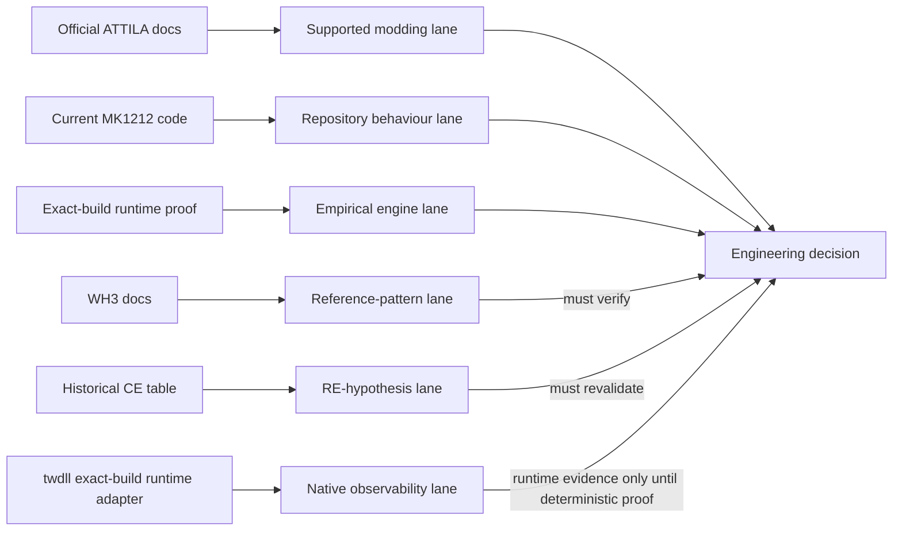

# Total War: ATTILA research authority

This directory is the source and evidence model for engineering work that touches Total War: ATTILA scripting, debugging, multiplayer determinism, runtime instrumentation, or future simultaneous-turn feasibility.

Issues: #3, #5, #7, #28  
Last reviewed: 2026-10-07

## Why this exists

MK1212 is an old, script-heavy Total War mod running on an engine whose public modding surface is much smaller than modern Total War titles. Reliable engineering therefore depends on keeping three kinds of evidence separate:

1. **supported ATTILA modding interfaces**;
2. **cross-title references that are useful patterns but not API proof**;
3. **historical runtime/reverse-engineering artefacts that can suggest investigation targets but cannot establish current addresses or supported behaviour**.

Do not collapse those categories into one "Total War API".

## Required primary sources

These three sources are the explicit foundation for this research set:

- Official ATTILA Assembly Kit page:  
  https://wiki.totalwar.com/w/Assembly_Kit_(TWA).html
- WH3 battle debug drawing reference:  
  https://chadvandy.github.io/tw_modding_resources/WH3/battle/battle_debug_drawing.html
- Historical Attila 1.6.0-9824 Cheat Engine table:  
  https://github.com/Hexorg/CheatEngineTables/blob/master/tables/attila_total_war_v1-6-0-9824_steam_fennix102_ce65_s32_t31_160.ct

Linked official ATTILA scripting pages are allowed and encouraged as extensions of the Assembly Kit authority.

## Authority hierarchy

Use evidence in this order:

| Tier | Evidence | Meaning |
| --- | --- | --- |
| A | Official ATTILA Assembly Kit / ATTILA scripting documentation | Highest public authority for supported Attila modding and documented interfaces |
| B | Current MK1212 code at an exact commit | Authority for what this fork actually executes |
| C | Exact-build empirical ATTILA runtime evidence | Authority for observed behaviour on a stated build/configuration |
| D | Modern Total War / WH3 documentation | Design/reference analogy only until Attila support is proven |
| E | Historical RE artefacts such as the 2016 CE table | Investigation hints only; no current-address or supported-API authority |

A lower tier must not silently override a higher tier. If a lower tier appears to contradict a higher tier, record the contradiction and design an experiment.

## Core rule

> **Compatibility must be proven, not inferred from family resemblance.**

Examples:

- A WH3 method named `debug_drawing:draw_line_on_terrain` is not an Attila API merely because both games are Total War.
- An `Attila.dll+offset` found in a 2016 CE table is not valid for a current executable until the exact build and signature are independently revalidated.
- A function present in current MK1212 code is not automatically multiplayer-safe because it works in single-player.
- A successful single-client test is not proof of OOS safety.

## Research lanes

## Documents

- [ATTILA Assembly Kit and scripting authority](ATTILA_ASSEMBLY_KIT.md)
- [WH3 debug drawing reference and compatibility boundary](WH3_DEBUG_DRAWING_REFERENCE.md)
- [Historical Attila CE table research notes](ATTILA_CE_TABLE_1_6_0_9824.md)
- [Multiplayer/runtime research playbook](MP_RUNTIME_RESEARCH_PLAYBOOK.md)
- [ATTILA multiplayer stability failure catalogue](ATTILA_MP_STABILITY_FAILURE_CATALOG.md)
- [Crash, OOM-like and resource-pressure hazards](ATTILA_CRASH_OOM_RESOURCE_HAZARDS.md)
- [MK1212 scripting safety guardrails](SCRIPT_SAFETY_GUARDRAILS.md)
- [twdll as the MK1212 runtime observability backend](TWDLL_OBSERVABILITY_BACKEND.md)
- [twdll runtime/code audit](TWDLL_RUNTIME_AUDIT.md)
- [Dual-peer multiplayer simulation harness](MP_DUAL_PEER_SIMULATION.md)
- [Two-client Windows lab](DUAL_CLIENT_LAB.md)
- [Multiplayer file debug logging and peer comparator](MP_DEBUG_LOGGING.md)
- [Upstream author handoff: multiplayer hardening](MULTIPLAYER_HARDENING_AUTHOR_HANDOFF.md)

## Evidence states

Use one of these labels in issues, PRs and research notes:

- **DOCUMENTED** — directly supported by official Attila documentation.
- **REPO-OBSERVED** — directly observed in current MK1212 code at a stated SHA.
- **RUNTIME-PROVEN** — reproduced on an exact Attila build/configuration.
- **CROSS-TITLE-REFERENCE** — useful behaviour/pattern from another Total War title, not yet proven in Attila.
- **HISTORICAL-RE** — reverse-engineering evidence from another/older Attila build.
- **COMMUNITY-REPORTED** — a symptom/workaround reported by players or modders; useful for prioritisation but not root-cause proof.
- **HYPOTHESIS** — plausible but unverified.
- **BLOCKED** — missing tool, build, environment, permission, or evidence.
- **REJECTED** — tested and shown false for the tested build/configuration.

## Non-goals

This documentation does not authorize:

- redistribution of Creative Assembly/SEGA binaries or proprietary assets;
- shipping modified `Attila.exe` / `Attila.dll`;
- implementing or distributing CRC/DRM bypasses;
- treating historical memory offsets as stable ABI;
- enabling undocumented engine behaviour in production without proof;
- claiming WH3 APIs exist in Attila without verification.

## Research change policy

For runtime-sensitive work:

1. identify the authority tier for every claim;
2. record exact repository SHA;
3. record exact game build and mod set when testing runtime behaviour;
4. isolate one variable per experiment where possible;
5. for multiplayer, collect evidence from **both peers**;
6. distinguish the first model divergence from the later point where the engine reports a desync;
7. publish negative results as well as positive ones;
8. keep instrumentation separate from gameplay changes where practical.

This directory is the canonical research authority for future MK1212 multiplayer/desync and simultaneous-turn work.

## Native runtime evidence lane

The current preferred native observability candidate is **twdll**:

- our fork: https://github.com/karnalooch/twdll
- upstream: https://github.com/bukowa/twdll
- API docs: https://bukowa.github.io/twdll/
- integration contract: [TWDLL_OBSERVABILITY_BACKEND.md](TWDLL_OBSERVABILITY_BACKEND.md)
- implementation audit: [TWDLL_RUNTIME_AUDIT.md](TWDLL_RUNTIME_AUDIT.md)

twdll-derived values are classified as **exact-build runtime evidence** only when their semantics and lifecycle are verified. Merely obtaining a value from native memory does not make it multiplayer-safe.
