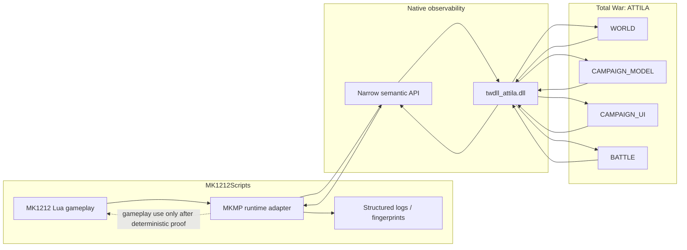
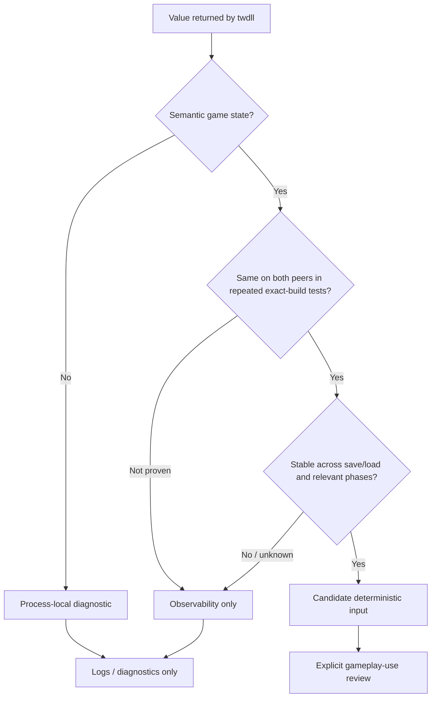
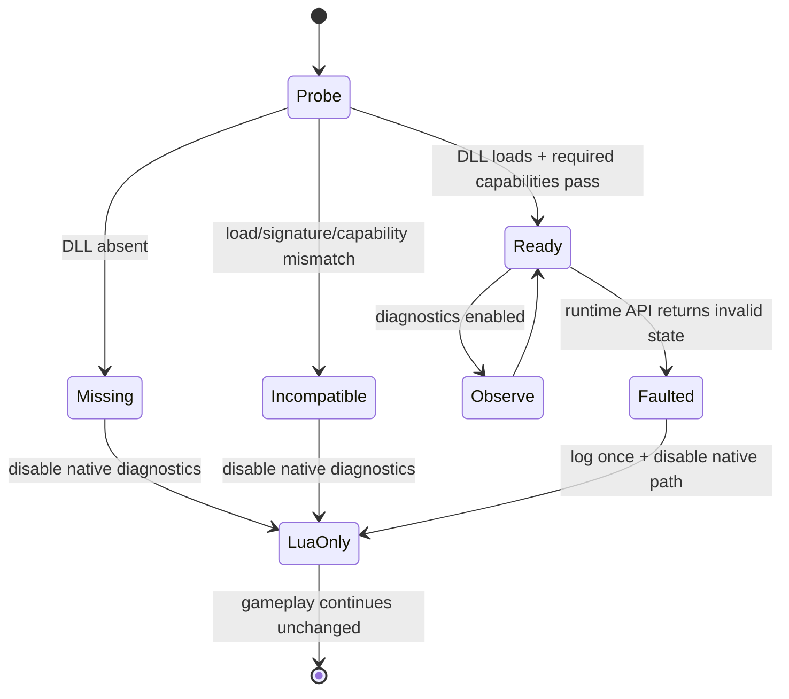

# twdll as the MK1212 runtime observability backend

Status: **canonical Attila runtime proven; MK1212 direct integration in progress; two-peer proof pending**  
Issues: #7, #44  
Last reviewed: 2026-10-07

## Links and provenance

- MK1212 repository: https://github.com/karnalooch/MK1212Scripts
- Canonical MK1212 native source: `native/twdll/`
- Import/provenance record: `native/twdll/UPSTREAM.md`
- Post-merge monorepo audit: `docs/research/TWDLL_MONOREPO_AUDIT.md`
- Native runtime/code audit: `docs/research/TWDLL_RUNTIME_AUDIT.md`
- Imported twdll baseline: `karnalooch/twdll@85c4db9836e3150df8ec5b38315de9940f8d624c`
- Historical twdll fork/reference: https://github.com/karnalooch/twdll
- Upstream twdll: https://github.com/bukowa/twdll
- Vendored MinHook baseline: `TsudaKageyu/minhook@d94c64d32ea37bc4f5ee47d580709f70c6fb6080`
- twdll API documentation: https://bukowa.github.io/twdll/

The current twdll project explicitly targets Total War: ATTILA and exposes native C++ functionality to the game's Lua VM through a loadable module.

## What twdll gives us

The supported loading pattern documented by twdll is:

```lua
local twdll = package.loadlib("twdll_attila.dll", "luaopen_twdll")()

twdll.core.Log("Hello from C++")
local faction_count = twdll.world.GetFactionCount()
```

The project already provides Attila-facing modules and hooks around runtime structures such as:

- `WORLD`;
- `CAMPAIGN_UI`;
- `CAMPAIGN_MODEL`;
- `BATTLE` / tactical battle state;
- engine-facing character/world/model helpers;
- native logging and build/runtime utilities.

The important consequence is architectural:

> MK1212 Lua does not need to read raw process memory itself. A native adapter can convert engine state into narrow semantic Lua values.

## Target architecture



## Design rule: DLL as eyes, Lua as brain

Initial integration is **read-only first**.

twdll may initially provide:

- build/runtime identity;
- campaign phase;
- current/active faction information;
- world/faction/force snapshots;
- battle state;
- state fingerprints;
- resource-pressure counters;
- structured native logging;
- diagnostics about hook/signature availability.

It must not silently become a second gameplay authority.

### Good first use

```lua
local state = mkmp.runtime.get_force_state(cqi)
mkmp.runtime.log_event("force_state", state)
```

### Not acceptable without proof

```lua
if mkmp.runtime.get_local_pointer() ~= 0 then
    cm:create_force(...)
end
```

Raw addresses, process-local pointers, local UI state, timing and thread-local state are not valid shared multiplayer authority.

## Data classification



### Process-local / diagnostic examples

These MUST NOT directly drive shared gameplay:

- memory addresses;
- module bases;
- hook addresses;
- local UI pointers;
- wall-clock timestamps;
- thread IDs;
- process memory addresses;
- local-only rendering/debug state;
- timing measurements.

### Candidate semantic values

These MAY be useful after proof:

- faction keys;
- region keys;
- CQIs;
- turn number;
- engine/model phase;
- force composition;
- region ownership;
- persistent campaign variables;
- deterministic battle/result state.

Even these remain **observability-only until both-peer determinism is demonstrated**.

## Multiplayer observability loop

The primary value of twdll for MK1212 is to find the **first divergence**, not only the later Attila OOS report.

```mermaid
sequenceDiagram
    participant H as Host Lua
    participant HD as Host twdll
    participant CD as Client twdll
    participant C as Client Lua

    H->>HD: snapshot before risky event
    C->>CD: snapshot before risky event
    HD-->>H: semantic fingerprint A0
    CD-->>C: semantic fingerprint A0

    Note over H,C: risky MK1212 event executes

    H->>HD: snapshot after mutation
    C->>CD: snapshot after mutation
    HD-->>H: fingerprint A1
    CD-->>C: fingerprint B1

    alt fingerprints match
        Note over H,C: continue; no divergence at this barrier
    else fingerprints differ
        Note over H,C: FIRST KNOWN DIVERGENCE FOUND
    end
```

This is especially useful around:

- invasion spawns;
- Papal/diplomacy transitions;
- battle -> campaign return;
- end-turn / AI-cycle boundaries;
- save/load;
- family-tree mutation;
- building-health changes.

## Implemented MKMP adapter

Do not expose twdll everywhere in product scripts.

The repository now owns one narrow adapter:

`campaigns/main_attila/common/mkmp_runtime.lua`

Current read-only API:

```text
MKMP_Runtime_Initialize()
MKMP_Runtime_Available()
MKMP_Runtime_Get_Environment_Fingerprint()
MKMP_Runtime_Get_Campaign_Snapshot()
MKMP_Runtime_Get_Battle_Telemetry()
MKMP_Runtime_Log_Barrier(name)
MKMP_Runtime_Status()
```

The adapter currently consumes only documented twdll capabilities needed for the first observability slice:

- `twdll.core.Log`;
- `twdll.core.GameBuild`;
- `twdll.core.GetBuildSha`;
- `twdll.world.GetFactionCount`;
- `twdll.battle.GetBattleInfo`.

For battle telemetry the adapter deliberately drops the `battle` and `manager` memory-address fields and exposes only semantic `cap` / `size` values.

The adapter:

- normalizes twdll return values;
- hides raw pointer/address details from ordinary Lua;
- exposes capability checks;
- provides stable failure behaviour;
- centralizes logging;
- makes later backend replacement possible.

## Load lifecycle

Upstream twdll documents an important lifecycle rule: load from the campaign script, after the campaign world exists.

Recommended integration point:

```text
campaigns/main_attila/scripting.lua
        |
        v
MKMP runtime bootstrap
        |
        +--> pcall(package.loadlib(...))
        |
        +--> capability check
        |
        +--> singleton-dependent API only after campaign world exists
```

Calling singleton-dependent functions too early may return `nil` or crash according to upstream documentation.

Utilities that do not require campaign singletons may have different lifecycle requirements; each API still needs explicit classification.

## Fail-closed fallback

The DLL is optional for gameplay until a future issue explicitly changes that contract.



### Required behaviour

If twdll is:

- missing;
- incompatible;
- unable to find required signatures;
- called before a required singleton exists;
- returning invalid data;

then:

1. emit a bounded diagnostic;
2. disable the affected native diagnostic capability;
3. keep MK1212 gameplay running through the normal Lua path;
4. do not guess or synthesize shared state;
5. do not retry indefinitely.

## Fingerprint design

A useful fingerprint should hash **semantic shared state**, not raw memory.

Example conceptual payload:

```text
turn=15
phase=faction_turn
current_faction=mk_fact_poland
regions=[...sorted keys/owners...]
forces=[...sorted CQI + faction + position + units...]
characters=[...sorted CQI + faction + family state...]
script_flags=[...versioned MK1212 shared state...]
```

Rules:

- stable sort order;
- stable serialization;
- exclude pointers/addresses;
- exclude wall-clock time;
- exclude local UI state;
- exclude non-shared visual state;
- version the fingerprint schema.

## Resource telemetry

twdll may eventually help distinguish:

- engine resource pressure;
- script-owned growth;
- battle transition slowdown;
- genuine allocation failure.

Potential diagnostics:

```text
process memory / commit
campaign entity counts
active force count
battle unit count
reinforcement queue size
script-owned table/timer/spawn counters
transition duration
```

Do not label a crash as OOM solely because memory usage is high.

## Security / legal / project boundary

For MK1212 this integration does not authorize:

- CRC/DRM bypass;
- modified Attila binary redistribution;
- patching historical CE offsets into the live executable;
- arbitrary native mutation;
- gameplay changes driven by unproven local runtime state.

`native/twdll/` is the MK1212 maintenance surface for controlled experimentation. The old `karnalooch/twdll` repository remains untouched as historical/upstream reference, and upstream provenance must remain visible.

## Build identity after the monorepo migration

`twdll.core.GetBuildSha()` returns the value compiled from `git rev-parse HEAD`. With `native/twdll/` inside MK1212Scripts, that value is the MK1212Scripts commit SHA used for the native build.

This is intentional. Runtime evidence should record the same repository SHA as the Lua/mod source under test, avoiding two independent source identities for one experiment. The original imported twdll SHA remains provenance only and is recorded in `native/twdll/UPSTREAM.md`.

Repository CI now has a separate proof boundary:

- compile the Attila target with the Visual Studio Win32 generator;
- assert caller-local jobs checked out the exact PR head (or exact push SHA);
- verify the resulting `twdll.dll` is an x86 PE image;
- verify the built image contains the `luaopen_twdll` export marker.

Those checks are repository/build proofs only. They do not by themselves prove runtime compatibility; that boundary was later crossed by the canonical real-game proof recorded below.

## Runtime safety contract after issue #40

The source-level runtime audit in `TWDLL_RUNTIME_AUDIT.md` hardens the native boundary before the staged Attila proof:

- the Attila Lua ABI is **all-or-nothing**: all 23 required signatures must resolve before module registration;
- the 33 game signatures remain per-capability: unresolved functions are cleared and reported as degraded rather than guessed;
- `DllMain` performs no logging, scanning, allocation-heavy initialization or hook installation;
- partial MinHook installation rolls back locally rather than leaving a knowingly half-installed feature;
- multiple Lua states share process-global hooks until the final registered state is collected;
- `twdll.log` is bounded to 8 MiB, individual native messages to 4096 bytes and Lua log calls to 64 arguments;
- diagnostics budget exhaustion is fail-soft and never cancels, retries or changes a gameplay mutation;
- the host guard requires the actual executable basename `attila.exe` plus `empire.retail.dll`.

Issue #42 / PR #43 adds a heavier native proof around that boundary: Release+Debug x86 builds under `/W4 /WX`, deterministic scanner fuzzing, logger concurrency/exact-byte-budget tests, host-guard tests and source-contract checks for the audit fixes. That stress proof found and fixed a Windows text-mode newline expansion bug in the logger budget.

## Canonical real-game Attila proof — 2026-10-07

The repository-native proof is now backed by a real Steam Attila run using the canonical upstream-style test harness and native source SHA:

`7c6f5b6d691313f128e9212e37c87c2292e79504`

Evidence bundle: `TWDLL-RUNTIME-EVIDENCE-20261007-213219.zip`.

Runtime fingerprints recorded by the harness:

- `Attila.exe` SHA-256: `51b833d5b8fd8505a7cd035fd92f68cace681d62ea74d9ad8fbae26326635bf5`;
- `empire.retail.dll` SHA-256: `8a40cbcff108e1cba14cc7eb6c7f4dfb054c7745b236d1bfc0fde5c85e2a353d`;
- tested `twdll.dll` SHA-256: `e34da1c67b13d3a30695f1d2fdfc01d02e215017257e7cc1c6918680ebf46189`.

Observed runtime result:

- required Lua ABI resolution: **23/23**;
- game signatures: **33/33**;
- native in-game assertions: **224 passed / 0 failed / 0 skipped**;
- `twdll.core.GetBuildSha()` returned the exact expected repository SHA;
- WORLD, CAMPAIGN_UI, settlement-slot, CAMPAIGN_MODEL, BATTLE and CAI occupation hooks installed successfully;
- save -> load executed successfully;
- final Lua-state teardown restored **3740 tweakers** and **714 campaign variables**, removed hooks, then a fresh Lua state re-resolved **23/23 + 33/33** and reinstalled hooks;
- lifecycle ended with `All tests and save/load cycle PASSED.`.

This proves **single-player canonical Attila runtime compatibility for that exact executable pair and native SHA**. It does **not** yet prove that the direct MK1212 bootstrap works in-product, nor that two peers observe identical native semantics.

Issue #44 moves from the canonical harness into the real MK1212 bootstrap. The product adapter now initializes from `Common_Initializer()` in both SP and MP, remains optional/fail-closed, validates `GameBuild == "Attila"` and a 40-character native build SHA, and allows only one `luaopen_twdll` per Lua state.

## Validation plan

### Stage 1 — canonical load proof — **PASS**

- current 2026 Attila build fingerprinted;
- exact twdll SHA recorded;
- native module loaded in the real process;
- `GameBuild` / `GetBuildSha` observed;
- 23/23 Lua ABI + 33/33 game signatures resolved;
- clean teardown observed.

### Stage 2 — canonical save/load proof — **PASS**

- canonical test campaign loaded;
- full native suite passed 224/224;
- save executed;
- load executed;
- hooks/tweakers/campaign variables restored on teardown;
- fresh Lua state reinitialized cleanly.

### Stage 2b — direct MK1212 product bootstrap — **IN PROGRESS (#44)**

- initialize the same adapter from the canonical MK1212 script path;
- prove SP product startup with and without the DLL;
- prove product save/load with no duplicate `luaopen_twdll` in one Lua state;
- preserve Lua-only gameplay when native observability is unavailable.

### Stage 3 — two-peer passive proof

- both peers run identical build/mod set;
- twdll loaded on both;
- no gameplay decisions use twdll;
- compare semantic snapshots at turn start/end.

### Stage 4 — known-risk barrier proof

Repeat around:

- Mongol/invasion trigger;
- battle -> campaign;
- river/bridge battle;
- end-turn AI cycle;
- Papal/diplomacy event.

### Stage 5 — fingerprint usefulness

Success means we can identify a first semantic divergence earlier than Attila's eventual OOS detection.

## Decision gate for gameplay use

Runtime-derived data may influence gameplay only after a separate issue proves:

1. same semantic value on both peers;
2. repeated exact-build determinism;
3. save/load stability;
4. phase stability;
5. no dependence on local timing/UI/address state;
6. deterministic failure/fallback semantics;
7. regression coverage.

Until then:

> **twdll is an observability backend, not a gameplay oracle.**


## Current implementation state

RUNTIME-PROVEN in the canonical single-player Attila harness:

- current tested Attila executable pair loads the exact native SHA;
- required Lua ABI resolves 23/23;
- game signatures resolve 33/33;
- native in-game suite passes 224/224;
- save/load reinitialization works with clean teardown and re-hooking.

Implemented for direct MK1212 integration on issue #44:

- `Common_Initializer()` initializes runtime observability in **both SP and MP**;
- repeated initialization in one Lua state is idempotent;
- loader candidates cover `twdll_attila.dll`, canonical `twdll`, and `twdll.dll`;
- wrong game identity or invalid build SHA fails closed;
- missing DLL / failed `luaopen_twdll` leaves normal Lua gameplay running;
- campaign singleton query remains after the campaign world exists;
- native build SHA and faction count remain diagnostic only;
- battle memory addresses are filtered;
- deterministic Lua-side semantic campaign snapshot remains available for later comparison.

Still intentionally unproven:

- direct MK1212 product runtime proof after #44 is packaged;
- two-peer passive behavior;
- exact host/client equality of semantic snapshots;
- whether merely loading twdll on both peers changes multiplayer engine behavior.

The remaining multiplayer items require real host/client Attila sessions and stay tracked separately from repository simulation.

## Product probe packaging correction — 2026-10-07 (#44 / PR #45)

**REPO-OBSERVED:** the archived product-SP artifact at `13ba7dc5965c43b252de88f7fd4cefe75f1f82b1`
contained only `common/main.lua` and `common/mkmp_runtime.lua` in its patch payload.
The former also requires `common/mkmp_debug.lua`. Depending on the Workshop version,
that omitted dependency can abort Lua bootstrap before any native marker.
This is a **HYPOTHESIS** for the failed launch, not a runtime-proven root cause.

Evidence `MK1212-PR45-SP-EVIDENCE-20261007-222514.zip` records preserved patched
Workshop content and `native_ready=false`, `debug_ready=false`; it contains no native,
MP-debug or bootstrap trace log. It proves neither runtime readiness nor the failure location.
The earlier native 224/224 proof remains specific to its separate canonical harness.

The repository now owns the product probe builder and launcher under `scripts/runtime/`:

- compute the full static `common/main` require closure (currently 14 Lua files,
  including SP-only occupation decisions and nested UI lists); reject missing dependencies;
- instrument only the test copy of `main.lua`, before the first require, recording
  module begin/success/failure, initializer entry and runtime identity;
- keep the original require exception semantics and bound trace output to 128 records
  per Lua state, a 64 KiB file budget and 512 message characters;
- require committed source, tracked payload files and a native DLL embedding the same SHA;
- publish a SHA-pinned CI artifact with payload/binary hash manifest;
- prove a real RPFM create/add/extract round-trip in CI and verify all patched file hashes
  again by extracting the Workshop clone before touching installed files;
- temporarily replace that same active Workshop pack, preserving launcher identity/load order;
- retain original backups, put all installed-file mutations and launch waiting inside
  `try/finally`, capture evidence before restoration and verify the original pack hash;
- preserve an externally updated Workshop pack and report restoration failure rather
  than silently overwriting concurrent changes;
- require bootstrap/initializer markers, exact-SHA native/debug readiness, pack preservation
  and successful rollback for PASS. Prior logs cannot satisfy a new run.

The harness does not change launcher metadata or user scripts. Exit Attila and the CA
Launcher before running; keep Steam running. Old probe packs in `data` must be removed
before the harness accepts a new isolated run. Backups remain beside the harness.

Build manually from a clean committed checkout with the exact-SHA Release DLL:

```powershell
python scripts/runtime/build_product_probe.py --dll build/twdll-attila/Release/twdll.dll --rpfm <path-to-rpfm_cli.exe> --output <outside-checkout-output>
```

CI uses RPFM v4.6.3 with the official release archive SHA-256 pinned in `ci.yml`.
Unzip the generated probe, run `RUN-MK1212-PR45-SP-TEST.cmd`, reach the single-player
campaign map, wait ten seconds and exit normally. Inspect `result.json` and
`PR45_RUNTIME_TRACE.txt` in the returned evidence ZIP before proposing another experiment.

**Local validation:** four packaging tests PASS; all 14 closure files compile under Lua
5.1; actual instrumented bootstrap plus production runtime adapter PASS with native-ready,
missing-DLL, missing-debug-module and trace-I/O-failure mocks. The missing-debug case records
the failing require and preserves the exception; absent DLL/trace I/O do not stop gameplay
initializers. MP simulation 38/38 and native source contracts 11/11 PASS. These are repository
proofs with mocked engine/dependency services, not Attila runtime proof.

**Remaining gate:** Windows CI syntax/native/artifact build and synthetic rollback checks and a fresh real MK1212 SP run,
then separate save/load and no-DLL product proof. Two-peer multiplayer remains unproven.
