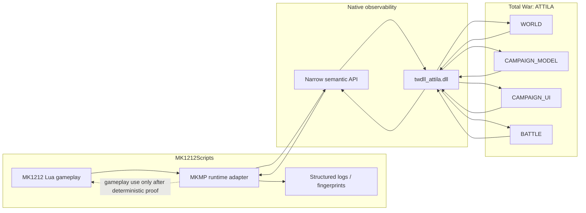
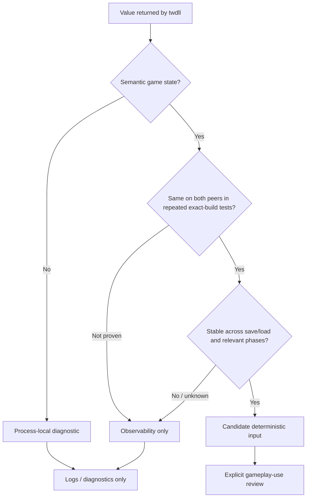
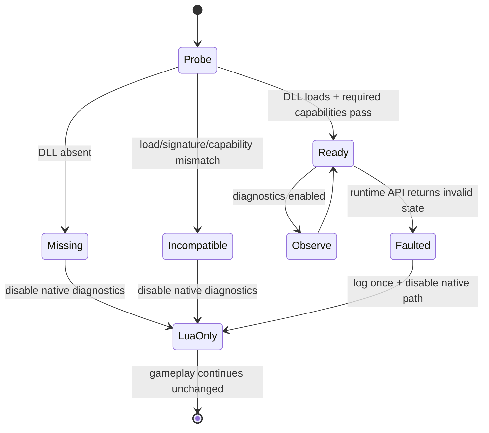

# twdll as the MK1212 runtime observability backend

Status: implementation-ready / runtime proof pending  
Issue: #7  
Last reviewed: 2026-10-07

## Links and provenance

- MK1212 repository: https://github.com/karnalooch/MK1212Scripts
- Canonical MK1212 native source: `native/twdll/`
- Import/provenance record: `native/twdll/UPSTREAM.md`
- Imported twdll baseline: `karnalooch/twdll@85c4db9836e3150df8ec5b38315de9940f8d624c`
- Historical twdll fork/reference: https://github.com/karnalooch/twdll
- Upstream twdll: https://github.com/bukowa/twdll
- Vendored MinHook baseline: `TsudaKageyu/minhook@d94c64d32ea37bc4f5ee47d580709f70c6fb6080`
- twdll API documentation: https://bukowa.github.io/twdll/

The current twdll project explicitly targets Total War: ATTILA and exposes native C++ functionality to the game's Lua VM through a loadable module.

## What twdll gives us

The supported loading pattern documented by twdll is:

```lua
local twdll = package.loadlib("twdll_attila.dll", "luaopen_twdll")()

twdll.core.Log("Hello from C++")
local faction_count = twdll.world.GetFactionCount()
```

The project already provides Attila-facing modules and hooks around runtime structures such as:

- `WORLD`;
- `CAMPAIGN_UI`;
- `CAMPAIGN_MODEL`;
- `BATTLE` / tactical battle state;
- engine-facing character/world/model helpers;
- native logging and build/runtime utilities.

The important consequence is architectural:

> MK1212 Lua does not need to read raw process memory itself. A native adapter can convert engine state into narrow semantic Lua values.

## Target architecture



## Design rule: DLL as eyes, Lua as brain

Initial integration is **read-only first**.

twdll may initially provide:

- build/runtime identity;
- campaign phase;
- current/active faction information;
- world/faction/force snapshots;
- battle state;
- state fingerprints;
- resource-pressure counters;
- structured native logging;
- diagnostics about hook/signature availability.

It must not silently become a second gameplay authority.

### Good first use

```lua
local state = mkmp.runtime.get_force_state(cqi)
mkmp.runtime.log_event("force_state", state)
```

### Not acceptable without proof

```lua
if mkmp.runtime.get_local_pointer() ~= 0 then
    cm:create_force(...)
end
```

Raw addresses, process-local pointers, local UI state, timing and thread-local state are not valid shared multiplayer authority.

## Data classification



### Process-local / diagnostic examples

These MUST NOT directly drive shared gameplay:

- memory addresses;
- module bases;
- hook addresses;
- local UI pointers;
- wall-clock timestamps;
- thread IDs;
- process memory addresses;
- local-only rendering/debug state;
- timing measurements.

### Candidate semantic values

These MAY be useful after proof:

- faction keys;
- region keys;
- CQIs;
- turn number;
- engine/model phase;
- force composition;
- region ownership;
- persistent campaign variables;
- deterministic battle/result state.

Even these remain **observability-only until both-peer determinism is demonstrated**.

## Multiplayer observability loop

The primary value of twdll for MK1212 is to find the **first divergence**, not only the later Attila OOS report.

```mermaid
sequenceDiagram
    participant H as Host Lua
    participant HD as Host twdll
    participant CD as Client twdll
    participant C as Client Lua

    H->>HD: snapshot before risky event
    C->>CD: snapshot before risky event
    HD-->>H: semantic fingerprint A0
    CD-->>C: semantic fingerprint A0

    Note over H,C: risky MK1212 event executes

    H->>HD: snapshot after mutation
    C->>CD: snapshot after mutation
    HD-->>H: fingerprint A1
    CD-->>C: fingerprint B1

    alt fingerprints match
        Note over H,C: continue; no divergence at this barrier
    else fingerprints differ
        Note over H,C: FIRST KNOWN DIVERGENCE FOUND
    end
```

This is especially useful around:

- invasion spawns;
- Papal/diplomacy transitions;
- battle -> campaign return;
- end-turn / AI-cycle boundaries;
- save/load;
- family-tree mutation;
- building-health changes.

## Implemented MKMP adapter

Do not expose twdll everywhere in product scripts.

The repository now owns one narrow adapter:

`campaigns/main_attila/common/mkmp_runtime.lua`

Current read-only API:

```text
MKMP_Runtime_Initialize()
MKMP_Runtime_Available()
MKMP_Runtime_Get_Environment_Fingerprint()
MKMP_Runtime_Get_Campaign_Snapshot()
MKMP_Runtime_Get_Battle_Telemetry()
MKMP_Runtime_Log_Barrier(name)
MKMP_Runtime_Status()
```

The adapter currently consumes only documented twdll capabilities needed for the first observability slice:

- `twdll.core.Log`;
- `twdll.core.GameBuild`;
- `twdll.core.GetBuildSha`;
- `twdll.world.GetFactionCount`;
- `twdll.battle.GetBattleInfo`.

For battle telemetry the adapter deliberately drops the `battle` and `manager` memory-address fields and exposes only semantic `cap` / `size` values.

The adapter:

- normalizes twdll return values;
- hide raw pointer/address details from ordinary Lua;
- expose capability checks;
- provide stable failure behaviour;
- centralize logging;
- make later backend replacement possible.

## Load lifecycle

Upstream twdll documents an important lifecycle rule: load from the campaign script, after the campaign world exists.

Recommended integration point:

```text
campaigns/main_attila/scripting.lua
        |
        v
MKMP runtime bootstrap
        |
        +--> pcall(package.loadlib(...))
        |
        +--> capability check
        |
        +--> singleton-dependent API only after campaign world exists
```

Calling singleton-dependent functions too early may return `nil` or crash according to upstream documentation.

Utilities that do not require campaign singletons may have different lifecycle requirements; each API still needs explicit classification.

## Fail-closed fallback

The DLL is optional for gameplay until a future issue explicitly changes that contract.



### Required behaviour

If twdll is:

- missing;
- incompatible;
- unable to find required signatures;
- called before a required singleton exists;
- returning invalid data;

then:

1. emit a bounded diagnostic;
2. disable the affected native diagnostic capability;
3. keep MK1212 gameplay running through the normal Lua path;
4. do not guess or synthesize shared state;
5. do not retry indefinitely.

## Fingerprint design

A useful fingerprint should hash **semantic shared state**, not raw memory.

Example conceptual payload:

```text
turn=15
phase=faction_turn
current_faction=mk_fact_poland
regions=[...sorted keys/owners...]
forces=[...sorted CQI + faction + position + units...]
characters=[...sorted CQI + faction + family state...]
script_flags=[...versioned MK1212 shared state...]
```

Rules:

- stable sort order;
- stable serialization;
- exclude pointers/addresses;
- exclude wall-clock time;
- exclude local UI state;
- exclude non-shared visual state;
- version the fingerprint schema.

## Resource telemetry

twdll may eventually help distinguish:

- engine resource pressure;
- script-owned growth;
- battle transition slowdown;
- genuine allocation failure.

Potential diagnostics:

```text
process memory / commit
campaign entity counts
active force count
battle unit count
reinforcement queue size
script-owned table/timer/spawn counters
transition duration
```

Do not label a crash as OOM solely because memory usage is high.

## Security / legal / project boundary

For MK1212 this integration does not authorize:

- CRC/DRM bypass;
- modified Attila binary redistribution;
- patching historical CE offsets into the live executable;
- arbitrary native mutation;
- gameplay changes driven by unproven local runtime state.

`native/twdll/` is the MK1212 maintenance surface for controlled experimentation. The old `karnalooch/twdll` repository remains untouched as historical/upstream reference, and upstream provenance must remain visible.

## Validation plan

### Stage 1 — load proof

- current 2026 Attila build;
- exact twdll SHA;
- load from campaign script;
- log `GameBuild`;
- query one read-only world value;
- unload/exit cleanly.

### Stage 2 — save/load proof

- new campaign;
- save;
- quit;
- reload;
- verify native adapter reinitializes cleanly;
- no duplicate hooks/listeners.

### Stage 3 — two-peer passive proof

- both peers run identical build/mod set;
- twdll loaded on both;
- no gameplay decisions use twdll;
- compare semantic snapshots at turn start/end.

### Stage 4 — known-risk barrier proof

Repeat around:

- Mongol/invasion trigger;
- battle -> campaign;
- river/bridge battle;
- end-turn AI cycle;
- Papal/diplomacy event.

### Stage 5 — fingerprint usefulness

Success means we can identify a first semantic divergence earlier than Attila's eventual OOS detection.

## Decision gate for gameplay use

Runtime-derived data may influence gameplay only after a separate issue proves:

1. same semantic value on both peers;
2. repeated exact-build determinism;
3. save/load stability;
4. phase stability;
5. no dependence on local timing/UI/address state;
6. deterministic failure/fallback semantics;
7. regression coverage.

Until then:

> **twdll is an observability backend, not a gameplay oracle.**


## Current implementation state

Implemented without claiming runtime proof:

- optional `package.loadlib` under `pcall`;
- missing DLL -> Lua-only gameplay continues;
- failed `luaopen_twdll` -> Lua-only gameplay continues;
- campaign singleton query occurs only from `Common_Initializer` after the campaign world exists;
- native build SHA and faction count are diagnostic only;
- battle memory addresses are filtered;
- deterministic Lua-side semantic campaign snapshot is available for later comparison.

Still intentionally unproven until the final runtime pass:

- current 2026 Attila binary compatibility;
- save/load reinitialization;
- two-peer passive behavior;
- exact host/client equality of semantic snapshots;
- whether loading twdll itself changes any MP engine behavior.

Those items remain open because they require running Attila, not because the adapter lacks an implementation path.
